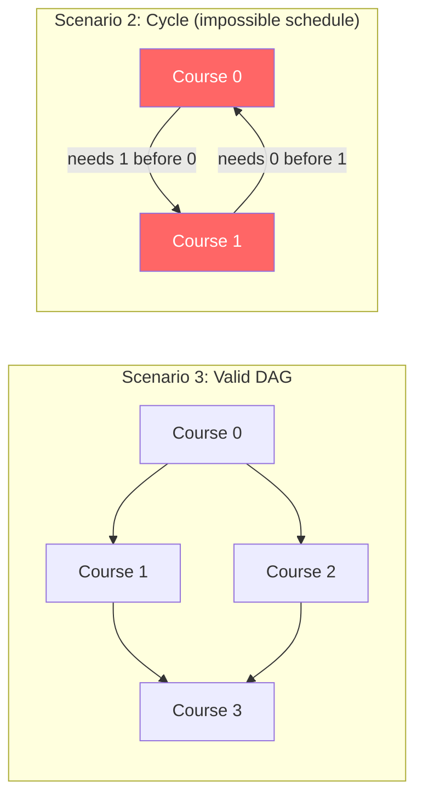

## [Q13_course_schedule_cycle_detection.md] Valid DAG vs Cycle (Mermaid)

```mermaid
flowchart LR
    subgraph Valid["Scenario 3: Valid DAG"]
        C0["Course 0"] --> C1["Course 1"]
        C0 --> C2["Course 2"]
        C1 --> C3["Course 3"]
        C2 --> C3
    end
    subgraph Cyclic["Scenario 2: Cycle (impossible schedule)"]
        D0["Course 0"] -->|"needs 1 before 0"| D1["Course 1"]
        D1 -->|"needs 0 before 1"| D0
    end
    style D0 fill:#f66,color:#fff
    style D1 fill:#f66,color:#fff
```
