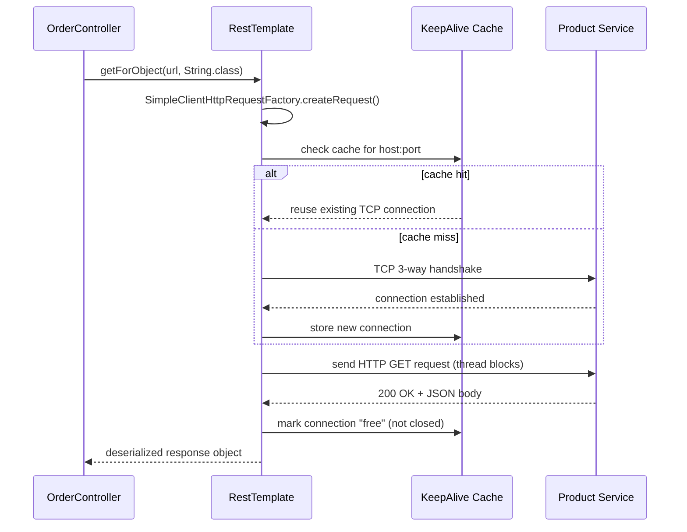

## [notes.md] Request Flow (Sequence)

```mermaid
sequenceDiagram
    participant OC as OrderController
    participant RT as RestTemplate
    participant KA as KeepAlive Cache
    participant PS as Product Service

    OC->>RT: getForObject(url, String.class)
    RT->>RT: SimpleClientHttpRequestFactory.createRequest()
    RT->>KA: check cache for host:port
    alt cache hit
        KA-->>RT: reuse existing TCP connection
    else cache miss
        RT->>PS: TCP 3-way handshake
        PS-->>RT: connection established
        RT->>KA: store new connection
    end
    RT->>PS: send HTTP GET request (thread blocks)
    PS-->>RT: 200 OK + JSON body
    RT->>KA: mark connection "free" (not closed)
    RT-->>OC: deserialized response object
```
