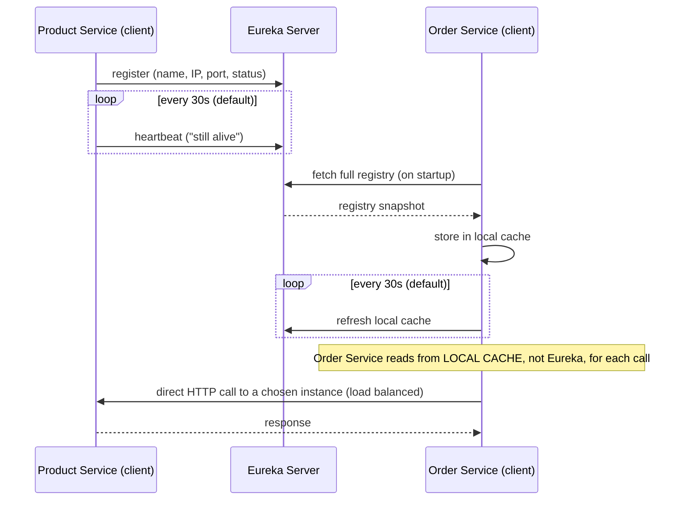

## [notes.md] Registration, Heartbeat & Discovery (Sequence)

```mermaid
sequenceDiagram
    participant PS as Product Service (client)
    participant ES as Eureka Server
    participant OS as Order Service (client)

    PS->>ES: register (name, IP, port, status)
    loop every 30s (default)
        PS->>ES: heartbeat ("still alive")
    end
    OS->>ES: fetch full registry (on startup)
    ES-->>OS: registry snapshot
    OS->>OS: store in local cache
    loop every 30s (default)
        OS->>ES: refresh local cache
    end
    Note over OS: Order Service reads from LOCAL CACHE, not Eureka, for each call
    OS->>PS: direct HTTP call to a chosen instance (load balanced)
    PS-->>OS: response
```
