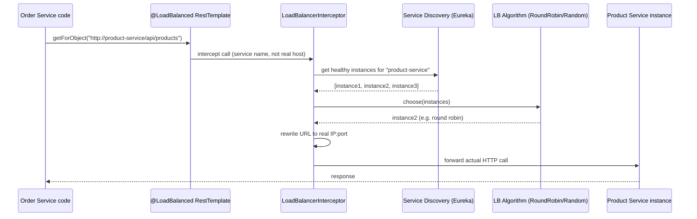

## [notes.md] Resolution Flow (Sequence)

```mermaid
sequenceDiagram
    participant OC as Order Service code
    participant RT as @LoadBalanced RestTemplate
    participant LBI as LoadBalancerInterceptor
    participant SD as Service Discovery (Eureka)
    participant Algo as LB Algorithm (RoundRobin/Random)
    participant PS as Product Service instance

    OC->>RT: getForObject("http://product-service/api/products")
    RT->>LBI: intercept call (service name, not real host)
    LBI->>SD: get healthy instances for "product-service"
    SD-->>LBI: [instance1, instance2, instance3]
    LBI->>Algo: choose(instances)
    Algo-->>LBI: instance2 (e.g. round robin)
    LBI->>LBI: rewrite URL to real IP:port
    LBI->>PS: forward actual HTTP call
    PS-->>OC: response
```
