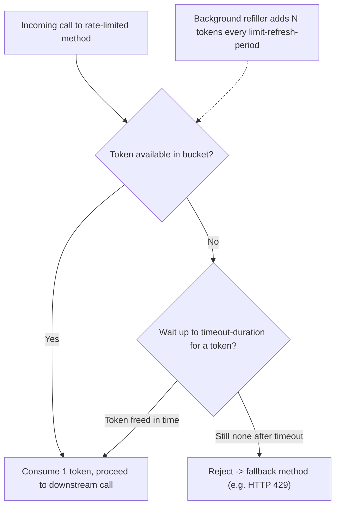

## [notes.md] Token Bucket Decision Flow

```mermaid
flowchart TD
    Req["Incoming call to rate-limited method"] --> TokenCheck{"Token available in bucket?"}
    TokenCheck -->|Yes| Consume["Consume 1 token, proceed to downstream call"]
    TokenCheck -->|No| WaitCheck{"Wait up to timeout-duration for a token?"}
    WaitCheck -->|Token freed in time| Consume
    WaitCheck -->|Still none after timeout| Reject["Reject -> fallback method (e.g. HTTP 429)"]
    Refill["Background refiller adds N tokens every limit-refresh-period"] -.-> TokenCheck
```
