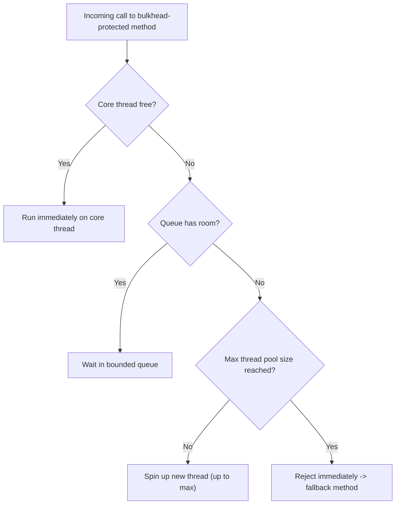

## [notes.md] Mermaid Diagram — Thread Pool Bulkhead Saturation

```mermaid
flowchart TD
    Req["Incoming call to bulkhead-protected method"] --> CoreFree{"Core thread free?"}
    CoreFree -->|Yes| RunNow["Run immediately on core thread"]
    CoreFree -->|No| QueueRoom{"Queue has room?"}
    QueueRoom -->|Yes| Enqueue["Wait in bounded queue"]
    QueueRoom -->|No| MaxReached{"Max thread pool size reached?"}
    MaxReached -->|No| SpawnThread["Spin up new thread (up to max)"]
    MaxReached -->|Yes| Reject["Reject immediately -> fallback method"]
```
