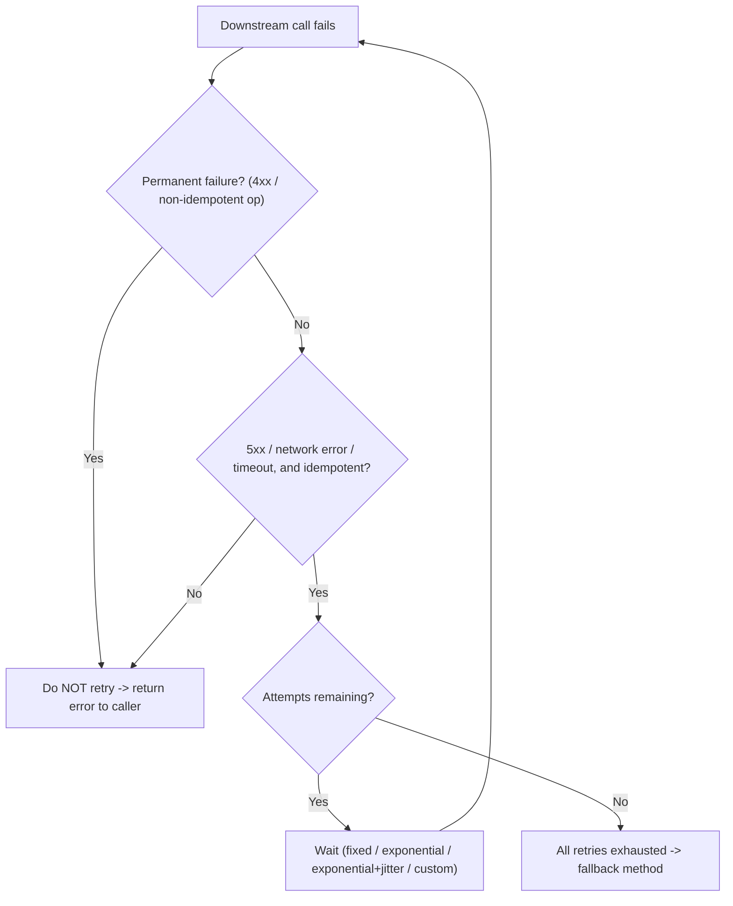

## [notes.md] Architecture / Decision Flow

```mermaid
flowchart TD
    Call["Downstream call fails"] --> Perm{"Permanent failure? (4xx / non-idempotent op)"}
    Perm -->|Yes| NoRetry["Do NOT retry -> return error to caller"]
    Perm -->|No| Retryable{"5xx / network error / timeout, and idempotent?"}
    Retryable -->|No| NoRetry
    Retryable -->|Yes| Attempts{"Attempts remaining?"}
    Attempts -->|Yes| Wait["Wait (fixed / exponential / exponential+jitter / custom)"]
    Wait --> Call
    Attempts -->|No| Fallback["All retries exhausted -> fallback method"]
```
