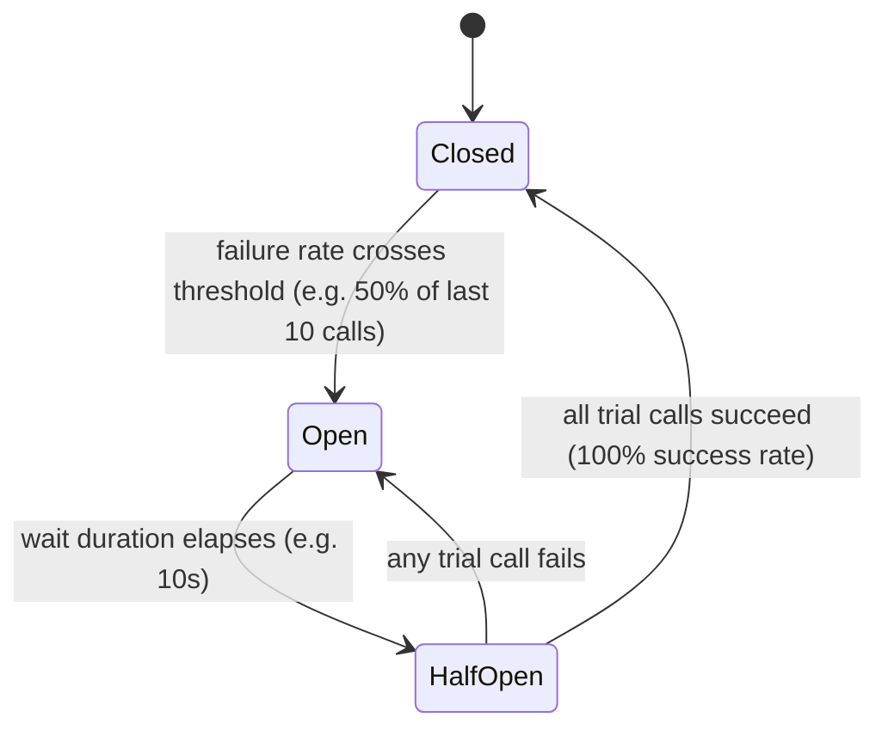

## [notes.md] The State Machine

```mermaid
stateDiagram-v2
    [*] --> Closed
    Closed --> Open: failure rate crosses threshold (e.g. 50% of last 10 calls)
    Open --> HalfOpen: wait duration elapses (e.g. 10s)
    HalfOpen --> Closed: all trial calls succeed (100% success rate)
    HalfOpen --> Open: any trial call fails
```
