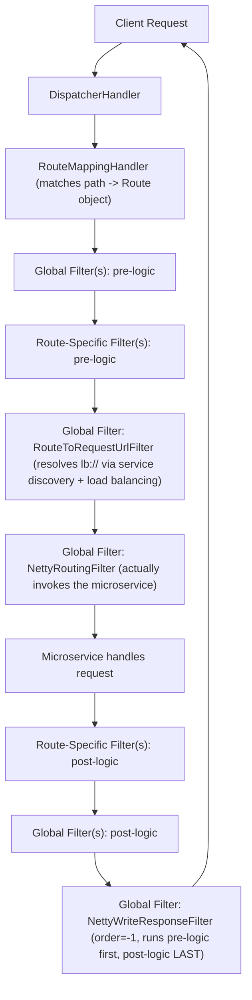

## [notes.md] The Request/Response Filter Chain

```mermaid
flowchart TD
    Client["Client Request"] --> Dispatcher["DispatcherHandler"]
    Dispatcher --> RouteMap["RouteMappingHandler (matches path -> Route object)"]
    RouteMap --> GF1["Global Filter(s): pre-logic"]
    GF1 --> RSF1["Route-Specific Filter(s): pre-logic"]
    RSF1 --> RouteToURL["Global Filter: RouteToRequestUrlFilter (resolves lb:// via service discovery + load balancing)"]
    RouteToURL --> NettyRouting["Global Filter: NettyRoutingFilter (actually invokes the microservice)"]
    NettyRouting --> Microservice["Microservice handles request"]
    Microservice --> RSF1Post["Route-Specific Filter(s): post-logic"]
    RSF1Post --> GF1Post["Global Filter(s): post-logic"]
    GF1Post --> NettyWrite["Global Filter: NettyWriteResponseFilter (order=-1, runs pre-logic first, post-logic LAST)"]
    NettyWrite --> Client
```
