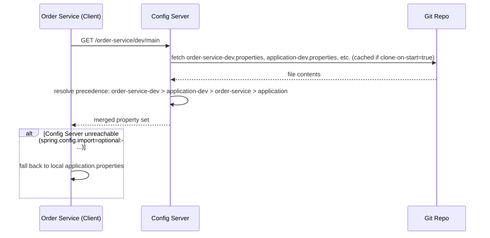

## [notes.md] Fetch Flow (Sequence)

```mermaid
sequenceDiagram
    participant OS as Order Service (Client)
    participant CS as Config Server
    participant Git as Git Repo

    OS->>CS: GET /order-service/dev/main
    CS->>Git: fetch order-service-dev.properties, application-dev.properties, etc. (cached if clone-on-start=true)
    Git-->>CS: file contents
    CS->>CS: resolve precedence: order-service-dev > application-dev > order-service > application
    CS-->>OS: merged property set
    alt Config Server unreachable (spring.config.import=optional:...)
        OS->>OS: fall back to local application.properties
    end
```
