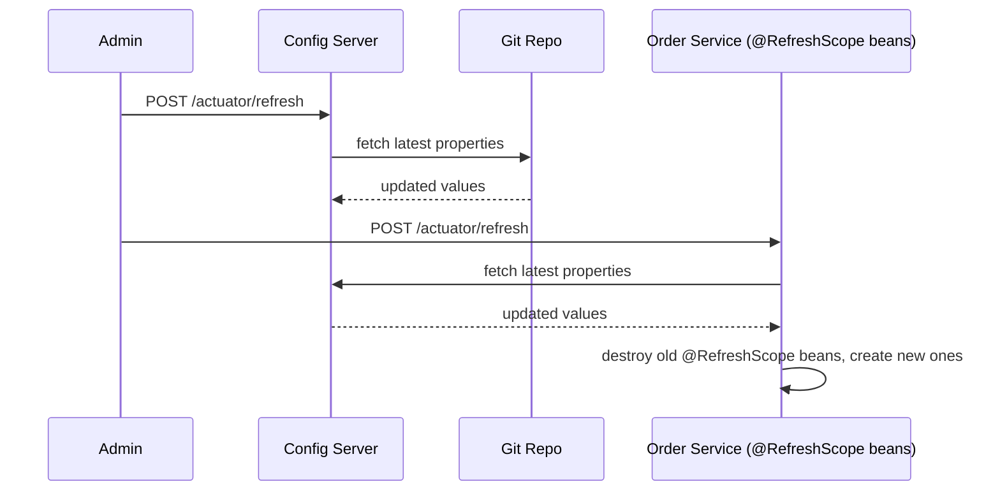

## [notes.md] How It Works

```mermaid
sequenceDiagram
    participant Admin
    participant ConfigServer as Config Server
    participant Git as Git Repo
    participant OrderService as Order Service (@RefreshScope beans)

    Admin->>ConfigServer: POST /actuator/refresh
    ConfigServer->>Git: fetch latest properties
    Git-->>ConfigServer: updated values
    Admin->>OrderService: POST /actuator/refresh
    OrderService->>ConfigServer: fetch latest properties
    ConfigServer-->>OrderService: updated values
    OrderService->>OrderService: destroy old @RefreshScope beans, create new ones
```
