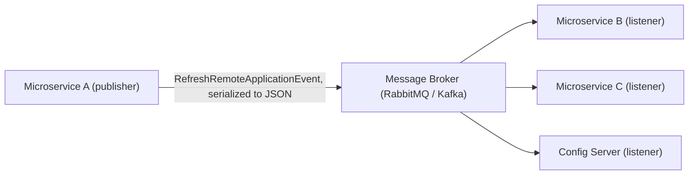

## [notes.md] How Spring Cloud Bus Extends This Across Microservices

```mermaid
flowchart LR
    A["Microservice A (publisher)"] -->|"RefreshRemoteApplicationEvent, serialized to JSON"| MB["Message Broker (RabbitMQ / Kafka)"]
    MB --> B["Microservice B (listener)"]
    MB --> C["Microservice C (listener)"]
    MB --> D["Config Server (listener)"]
```
