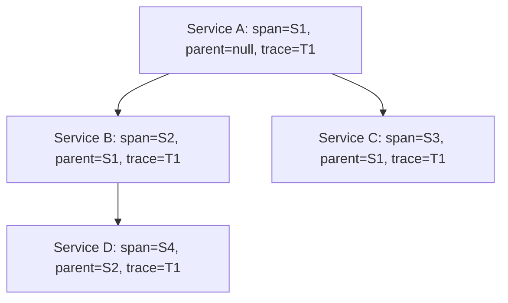

## [notes.md] Trace ID and Span ID — The Two Concepts That Make This Work

```mermaid
flowchart TD
    A["Service A: span=S1, parent=null, trace=T1"] --> B["Service B: span=S2, parent=S1, trace=T1"]
    A --> C["Service C: span=S3, parent=S1, trace=T1"]
    B --> D["Service D: span=S4, parent=S2, trace=T1"]
```
