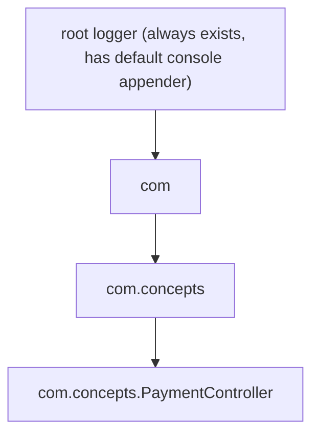

## [notes.md] Parent-Child Logger Hierarchy — The Core Mental Model

```mermaid
flowchart TD
    Root["root logger (always exists, has default console appender)"] --> Com["com"]
    Com --> Concepts["com.concepts"]
    Concepts --> Controller["com.concepts.PaymentController"]
```
