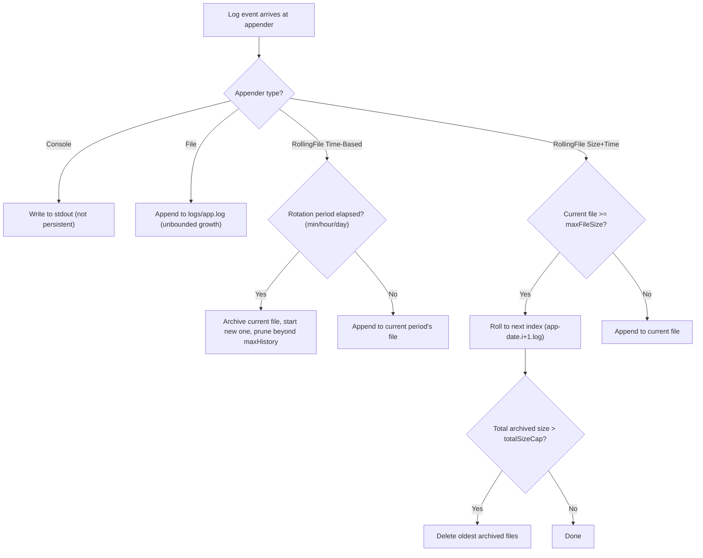

## [notes.md] Appender Decision Flow

```mermaid
flowchart TD
    Log["Log event arrives at appender"] --> Type{"Appender type?"}
    Type -->|Console| Stdout["Write to stdout (not persistent)"]
    Type -->|File| Disk["Append to logs/app.log (unbounded growth)"]
    Type -->|RollingFile Time-Based| TimeCheck{"Rotation period elapsed? (min/hour/day)"}
    TimeCheck -->|Yes| ArchiveTime["Archive current file, start new one, prune beyond maxHistory"]
    TimeCheck -->|No| AppendTime["Append to current period's file"]
    Type -->|RollingFile Size+Time| SizeCheck{"Current file >= maxFileSize?"}
    SizeCheck -->|Yes| Increment["Roll to next index (app-date.i+1.log)"]
    SizeCheck -->|No| AppendSize["Append to current file"]
    Increment --> CapCheck{"Total archived size > totalSizeCap?"}
    CapCheck -->|Yes| Prune["Delete oldest archived files"]
    CapCheck -->|No| Done["Done"]
```
