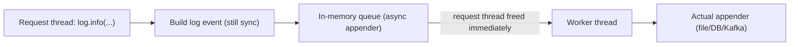

## [notes.md] Async Appender — How It Works

```mermaid
flowchart LR
    Req["Request thread: log.info(...)"] --> Event["Build log event (still sync)"]
    Event --> Queue["In-memory queue (async appender)"]
    Queue -->|"request thread freed immediately"| Worker["Worker thread"]
    Worker --> RealAppender["Actual appender (file/DB/Kafka)"]
```
