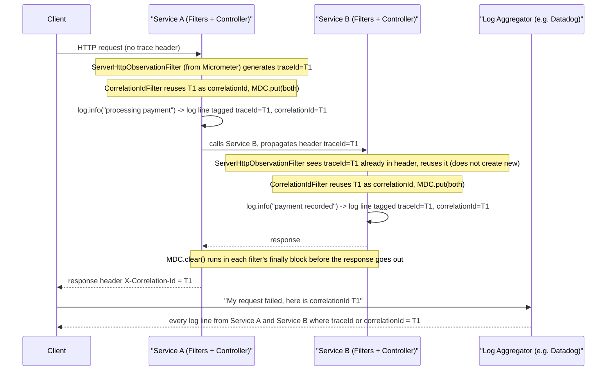
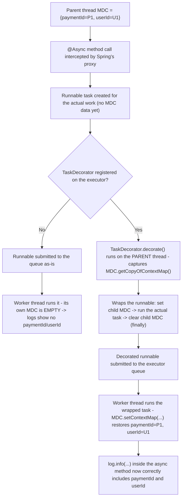

## [notes.md] Correlation ID / Trace ID flowing across services and into every log line

```mermaid
sequenceDiagram
    participant Client
    participant SvcA as "Service A (Filters + Controller)"
    participant SvcB as "Service B (Filters + Controller)"
    participant Agg as "Log Aggregator (e.g. Datadog)"

    Client->>SvcA: HTTP request (no trace header)
    Note over SvcA: ServerHttpObservationFilter (from Micrometer) generates traceId=T1
    Note over SvcA: CorrelationIdFilter reuses T1 as correlationId, MDC.put(both)
    SvcA->>SvcA: log.info("processing payment") -> log line tagged traceId=T1, correlationId=T1
    SvcA->>SvcB: calls Service B, propagates header traceId=T1
    Note over SvcB: ServerHttpObservationFilter sees traceId=T1 already in header, reuses it (does not create new)
    Note over SvcB: CorrelationIdFilter reuses T1 as correlationId, MDC.put(both)
    SvcB->>SvcB: log.info("payment recorded") -> log line tagged traceId=T1, correlationId=T1
    SvcB-->>SvcA: response
    Note over SvcA,SvcB: MDC.clear() runs in each filter's finally block before the response goes out
    SvcA-->>Client: response header X-Correlation-Id = T1
    Client->>Agg: "My request failed, here is correlationId T1"
    Agg-->>Client: every log line from Service A and Service B where traceId or correlationId = T1
```

## [notes.md] MDC does NOT cross thread boundaries — how `TaskDecorator` fixes it for `@Async`

```mermaid
flowchart TD
    A["Parent thread MDC = {paymentId=P1, userId=U1}"] --> B["@Async method call intercepted by Spring's proxy"]
    B --> C["Runnable task created for the actual work (no MDC data yet)"]
    C --> D{"TaskDecorator registered on the executor?"}
    D -->|No| E["Runnable submitted to the queue as-is"]
    E --> F["Worker thread runs it - its own MDC is EMPTY -> logs show no paymentId/userId"]
    D -->|Yes| G["TaskDecorator.decorate() runs on the PARENT thread - captures MDC.getCopyOfContextMap()"]
    G --> H["Wraps the runnable: set child MDC -> run the actual task -> clear child MDC (finally)"]
    H --> I["Decorated runnable submitted to the executor queue"]
    I --> J["Worker thread runs the wrapped task - MDC.setContextMap(...) restores paymentId=P1, userId=U1"]
    J --> K["log.info(...) inside the async method now correctly includes paymentId and userId"]
```
