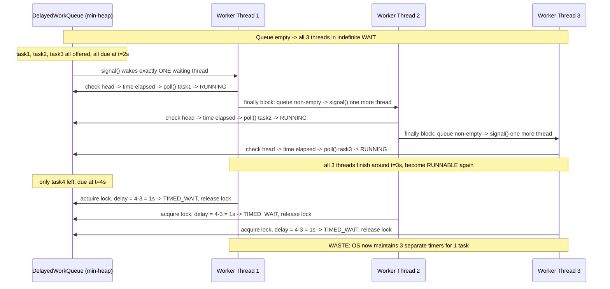

## [notes.md] The Naive (Non-Optimized) Flow



## [notes.md] The Optimized Flow — Leader-Follower Pattern

```mermaid
stateDiagram-v2
    [*] --> Waiting: pool created, leader = null

    Waiting --> Runnable: signaled (task became/is head of queue)
    Runnable --> CheckHead: acquire lock, peek queue head

    CheckHead --> Running: delay <= 0 (time elapsed) -> poll() task
    CheckHead --> BecomeLeader: delay > 0 AND leader == null
    CheckHead --> Waiting: delay > 0 AND leader != null (indefinite wait, NO OS timer)

    BecomeLeader --> TimedWait: leader = currentThread; awaitNanos(delay)
    TimedWait --> CheckHead: OS timer expires -> leader = null -> re-check head

    Running --> Waiting: task finished; if queue non-empty, signal one follower
    Running --> [*]: pool shutdown
```
