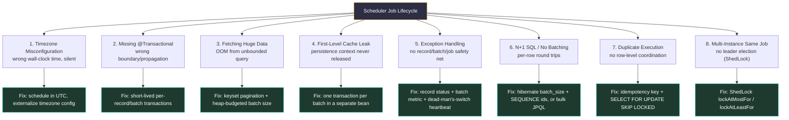

## [senior_interview_guide.md] The 8 Pitfalls at a Glance

```mermaid
flowchart TD
    A[Scheduler Job Lifecycle] --> B["1. Timezone Misconfiguration<br/>wrong wall-clock time, silent"]
    A --> C["2. Missing @Transactional<br/>wrong boundary/propagation"]
    A --> D["3. Fetching Huge Data<br/>OOM from unbounded query"]
    A --> E["4. First-Level Cache Leak<br/>persistence context never released"]
    A --> F["5. Exception Handling<br/>no record/batch/job safety net"]
    A --> G["6. N+1 SQL / No Batching<br/>per-row round trips"]
    A --> H["7. Duplicate Execution<br/>no row-level coordination"]
    A --> I["8. Multi-Instance Same Job<br/>no leader election (ShedLock)"]

    B --> B1[Fix: schedule in UTC, externalize timezone config]
    C --> C1[Fix: short-lived per-record/batch transactions]
    D --> D1[Fix: keyset pagination + heap-budgeted batch size]
    E --> E1[Fix: one transaction per batch in a separate bean]
    F --> F1[Fix: record status + batch metric + dead-man's-switch heartbeat]
    G --> G1[Fix: hibernate batch_size + SEQUENCE ids, or bulk JPQL]
    H --> H1[Fix: idempotency key + SELECT FOR UPDATE SKIP LOCKED]
    I --> I1[Fix: ShedLock lockAtMostFor / lockAtLeastFor]

    style A fill:#2d2d44,stroke:#f5a623,color:#fff
    style B1 fill:#1e3a2f,stroke:#00bfa5,color:#fff
    style C1 fill:#1e3a2f,stroke:#00bfa5,color:#fff
    style D1 fill:#1e3a2f,stroke:#00bfa5,color:#fff
    style E1 fill:#1e3a2f,stroke:#00bfa5,color:#fff
    style F1 fill:#1e3a2f,stroke:#00bfa5,color:#fff
    style G1 fill:#1e3a2f,stroke:#00bfa5,color:#fff
    style H1 fill:#1e3a2f,stroke:#00bfa5,color:#fff
    style I1 fill:#1e3a2f,stroke:#00bfa5,color:#fff
```
