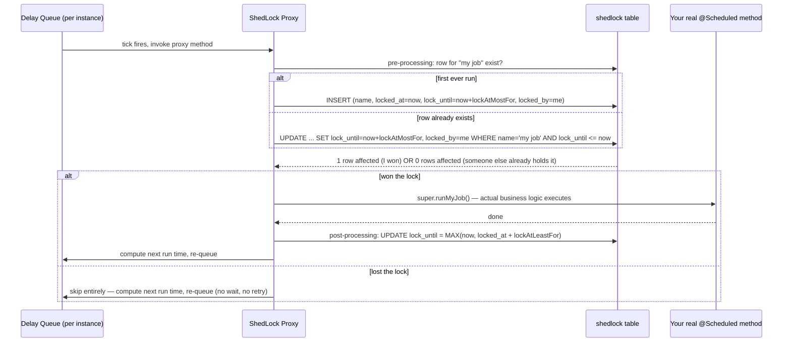

## [notes.md] The proxy mechanism

```mermaid
sequenceDiagram
    participant Q as Delay Queue (per instance)
    participant Proxy as ShedLock Proxy
    participant DB as shedlock table
    participant Job as Your real @Scheduled method

    Q->>Proxy: tick fires, invoke proxy method
    Proxy->>DB: pre-processing: row for "my job" exist?
    alt first ever run
        Proxy->>DB: INSERT (name, locked_at=now, lock_until=now+lockAtMostFor, locked_by=me)
    else row already exists
        Proxy->>DB: UPDATE ... SET lock_until=now+lockAtMostFor, locked_by=me WHERE name='my job' AND lock_until <= now
    end
    DB-->>Proxy: 1 row affected (I won) OR 0 rows affected (someone else already holds it)
    alt won the lock
        Proxy->>Job: super.runMyJob() — actual business logic executes
        Job-->>Proxy: done
        Proxy->>DB: post-processing: UPDATE lock_until = MAX(now, locked_at + lockAtLeastFor)
        Proxy->>Q: compute next run time, re-queue
    else lost the lock
        Proxy->>Q: skip entirely — compute next run time, re-queue (no wait, no retry)
    end
```
