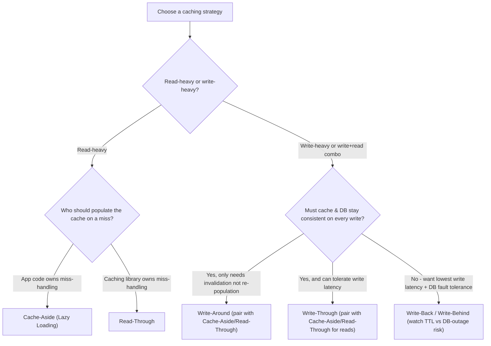

# Mermaid Diagrams — Extracted

Diagrams extracted from `interviewguide.md` and replaced in-place with ASCII-art equivalents. Kept here verbatim for anyone who wants the interactive/renderable Mermaid version.

## From `interviewguide.md` — "Choosing a Strategy (Decision Flowchart)"

