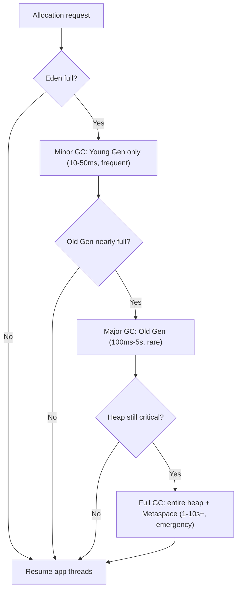
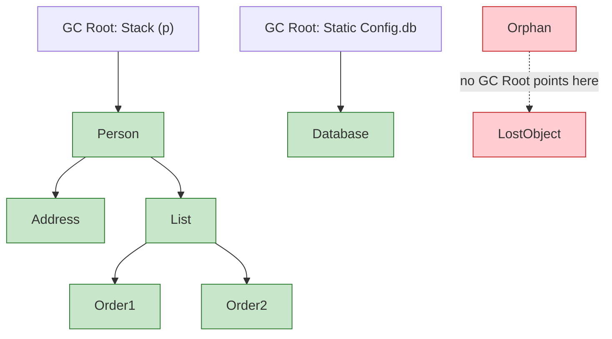
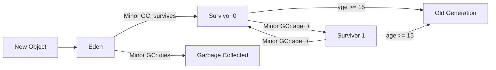
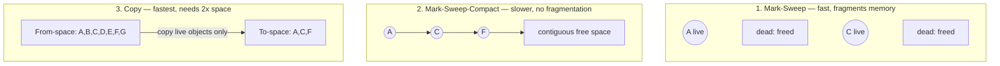

## [Q6_generational_gc.md] Which GC Runs When (Mermaid Decision Flow)

## [Q3_gc_marking_phase.md] Reachability Graph (Mermaid)

## [Q5_heap_generations.md] Object Promotion Flow (Mermaid)

## [Q4_gc_sweeping_phase.md] All Three Strategies Side-by-Side (Mermaid)

