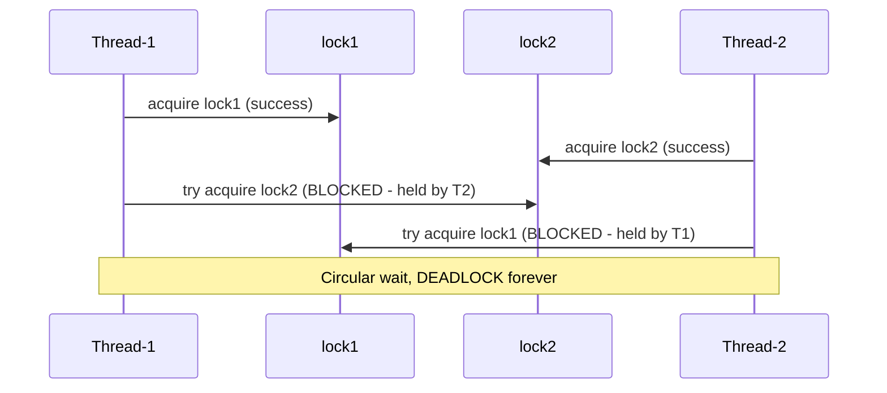
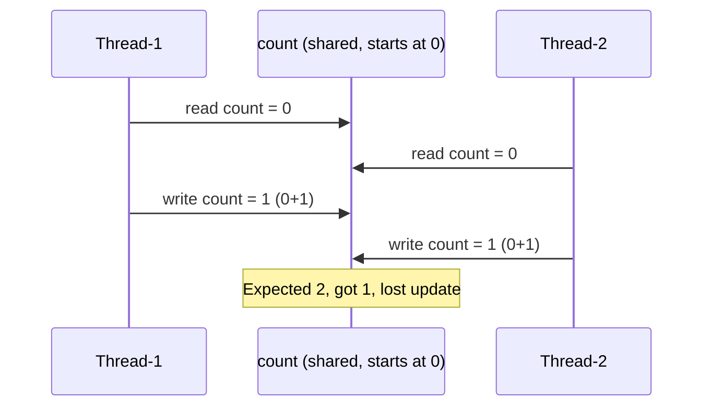
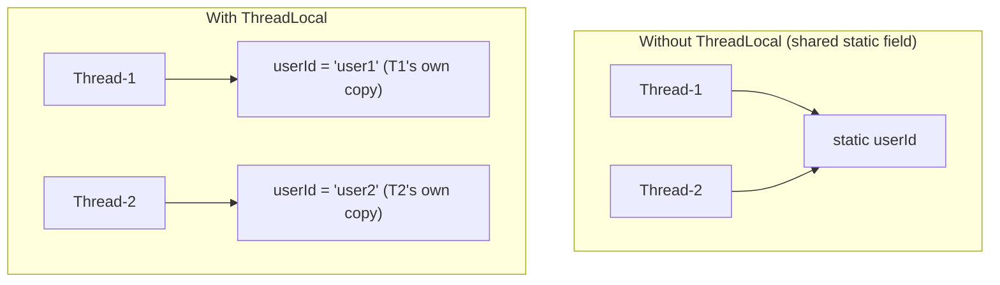

## [deadlock-scenarios-prevention.md] Classic Deadlock Pattern (Mermaid)

## [race-conditions-thread-problems.md] Lost Update, Visualized (Mermaid)

## [threadlocal-usage-patterns.md] Key Principle: ThreadLocal Storage (diagram)

