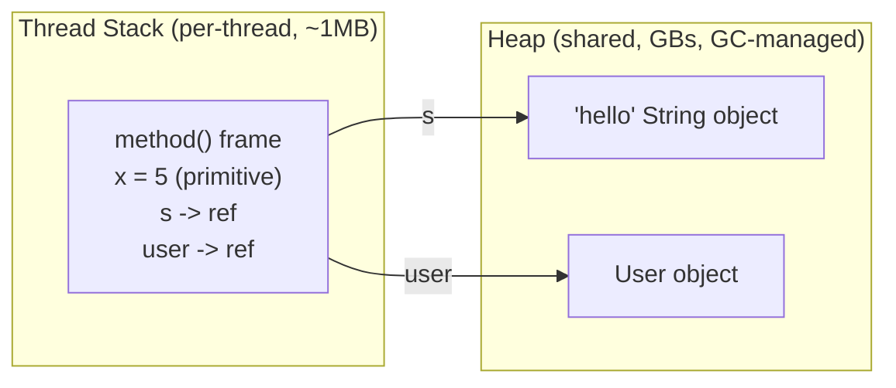
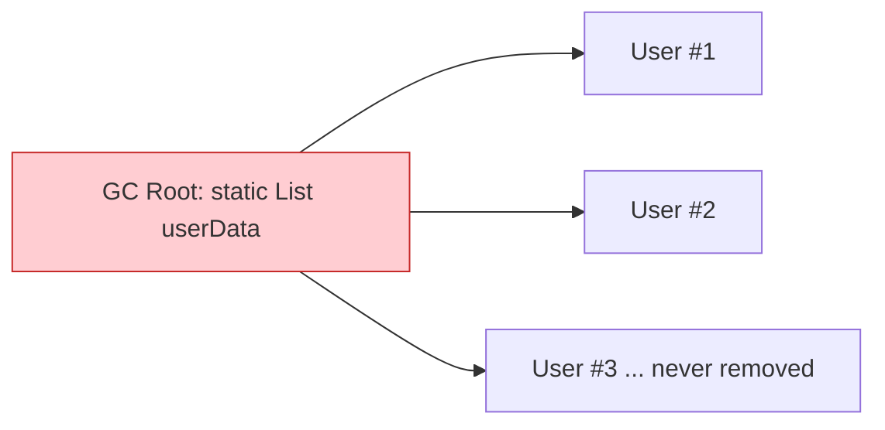

## [Q42_heap_vs_stack.md] Memory Layout (Mermaid)

```mermaid
flowchart LR
    subgraph Stack["Thread Stack (per-thread, ~1MB)"]
        F1["method() frame<br/>x = 5 (primitive)<br/>s -&gt; ref<br/>user -&gt; ref"]
    end
    subgraph Heap["Heap (shared, GBs, GC-managed)"]
        Str["'hello' String object"]
        Obj["User object"]
    end
    F1 -->|s| Str
    F1 -->|user| Obj
```

## [Q43_memory_leak_detection.md] Retained Reference Chain (Mermaid)

```mermaid
graph LR
    Root["GC Root: static List<User> userData"] --> U1["User #1"]
    Root --> U2["User #2"]
    Root --> U3["User #3 ... never removed"]
    style Root fill:#ffcdd2,stroke:#c62828
```
