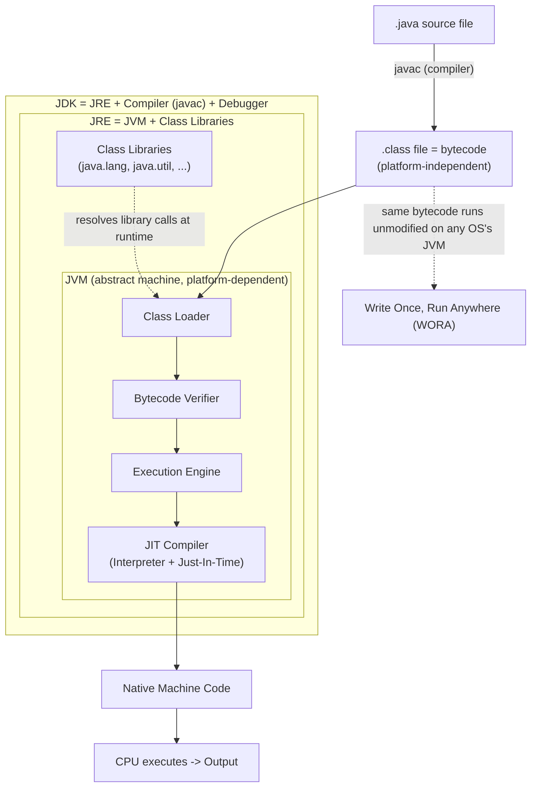

## [notes.md] Diagram

```mermaid
flowchart TB
    SRC[".java source file"] -->|"javac (compiler)"| BYTE[".class file = bytecode<br/>(platform-independent)"]

    subgraph JDK["JDK = JRE + Compiler (javac) + Debugger"]
        subgraph JRE["JRE = JVM + Class Libraries"]
            LIBS["Class Libraries<br/>(java.lang, java.util, ...)"]
            subgraph JVM["JVM (abstract machine, platform-dependent)"]
                CL["Class Loader"]
                BV["Bytecode Verifier"]
                EE["Execution Engine"]
                JIT["JIT Compiler<br/>(Interpreter + Just-In-Time)"]
                CL --> BV --> EE --> JIT
            end
            LIBS -. "resolves library calls at runtime" .-> CL
        end
    end

    BYTE --> CL
    JIT --> NATIVE["Native Machine Code"]
    NATIVE --> CPU["CPU executes -> Output"]

    BYTE -. "same bytecode runs unmodified on any OS's JVM" .-> NOTE["Write Once, Run Anywhere (WORA)"]
```
