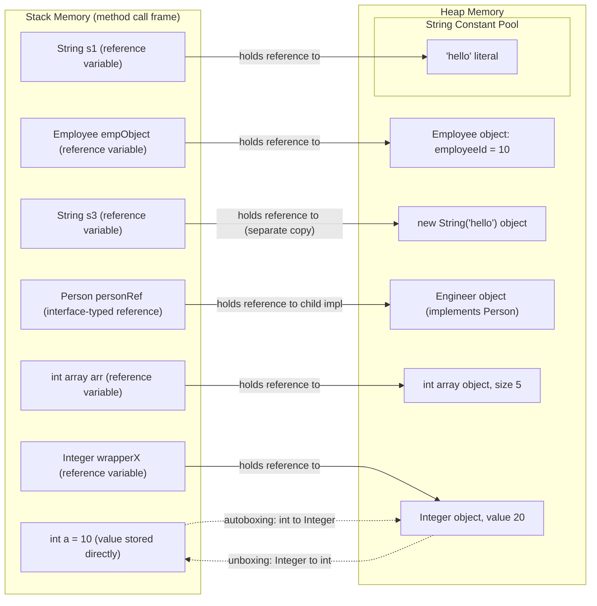

## [notes.md] Reference Types and Where They Live: Stack vs Heap

```mermaid
flowchart LR
    subgraph Stack["Stack Memory (method call frame)"]
        pa["int a = 10 (value stored directly)"]
        rv1["Employee empObject (reference variable)"]
        rv2["String s1 (reference variable)"]
        rv3["String s3 (reference variable)"]
        rv4["Person personRef (interface-typed reference)"]
        rv5["int array arr (reference variable)"]
        rv6["Integer wrapperX (reference variable)"]
    end

    subgraph Heap["Heap Memory"]
        subgraph SCP["String Constant Pool"]
            lit["'hello' literal"]
        end
        empObj["Employee object: employeeId = 10"]
        s3obj["new String('hello') object"]
        engObj["Engineer object (implements Person)"]
        arrObj["int array object, size 5"]
        wrapObj["Integer object, value 20"]
    end

    rv1 -- "holds reference to" --> empObj
    rv2 -- "holds reference to" --> lit
    rv3 -- "holds reference to (separate copy)" --> s3obj
    rv4 -- "holds reference to child impl" --> engObj
    rv5 -- "holds reference to" --> arrObj
    rv6 -- "holds reference to" --> wrapObj

    pa -. "autoboxing: int to Integer" .-> wrapObj
    wrapObj -. "unboxing: Integer to int" .-> pa
```
