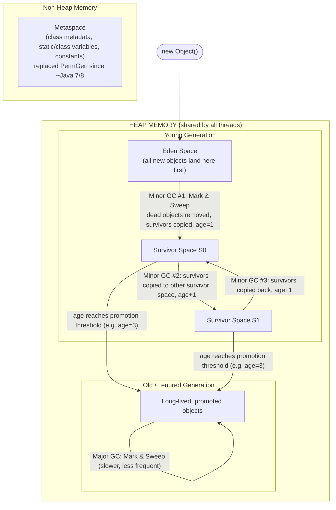

## [notes.md] Heap Generations and GC Flow

```mermaid
flowchart TB
    NewObj(["new Object()"]) --> Eden

    subgraph Heap["HEAP MEMORY (shared by all threads)"]
        subgraph Young["Young Generation"]
            Eden["Eden Space<br/>(all new objects land here first)"]
            S0["Survivor Space S0"]
            S1["Survivor Space S1"]
        end
        subgraph OldGen["Old / Tenured Generation"]
            Old["Long-lived, promoted objects"]
        end
    end

    subgraph NonHeap["Non-Heap Memory"]
        Meta["Metaspace<br/>(class metadata, static/class variables, constants)<br/>replaced PermGen since ~Java 7/8"]
    end

    Eden -->|"Minor GC #1: Mark & Sweep<br/>dead objects removed, survivors copied, age=1"| S0
    S0 -->|"Minor GC #2: survivors copied to other survivor space, age+1"| S1
    S1 -->|"Minor GC #3: survivors copied back, age+1"| S0
    S0 -->|"age reaches promotion threshold (e.g. age=3)"| Old
    S1 -->|"age reaches promotion threshold (e.g. age=3)"| Old
    Old -->|"Major GC: Mark & Sweep (slower, less frequent)"| Old
```
