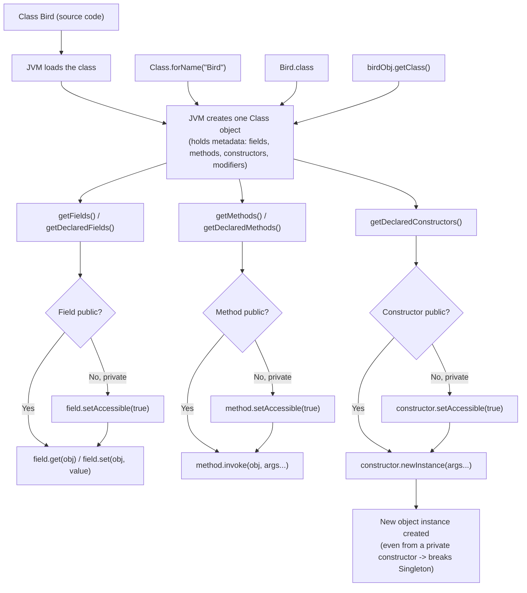

## [notes.md] How Reflection Works

```mermaid
flowchart TD
    A["Class Bird (source code)"] --> B["JVM loads the class"]
    B --> C["JVM creates one Class object\n(holds metadata: fields, methods, constructors, modifiers)"]

    D1["Class.forName(&quot;Bird&quot;)"] --> C
    D2["Bird.class"] --> C
    D3["birdObj.getClass()"] --> C

    C --> E["getFields() / getDeclaredFields()"]
    C --> F["getMethods() / getDeclaredMethods()"]
    C --> G["getDeclaredConstructors()"]

    E --> H{"Field public?"}
    H -->|Yes| I["field.get(obj) / field.set(obj, value)"]
    H -->|No, private| J["field.setAccessible(true)"] --> I

    F --> K{"Method public?"}
    K -->|Yes| L["method.invoke(obj, args...)"]
    K -->|No, private| M["method.setAccessible(true)"] --> L

    G --> N{"Constructor public?"}
    N -->|Yes| O["constructor.newInstance(args...)"]
    N -->|No, private| P["constructor.setAccessible(true)"] --> O
    O --> Q["New object instance created\n(even from a private constructor -> breaks Singleton)"]
```
