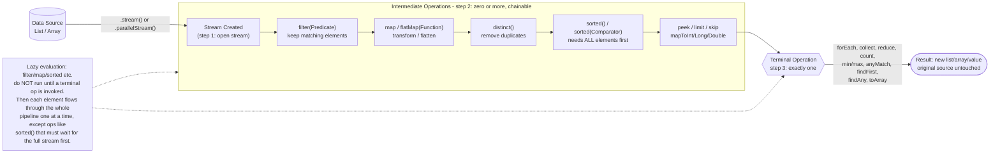

## [notes.md] Stream Pipeline (with Lazy Evaluation)

```mermaid
flowchart LR
    A[("Data Source<br/>List / Array")] -->|".stream() or .parallelStream()"| B["Stream Created<br/>(step 1: open stream)"]

    subgraph PIPE["Intermediate Operations - step 2: zero or more, chainable"]
        direction LR
        B --> C1["filter(Predicate)<br/>keep matching elements"]
        C1 --> C2["map / flatMap(Function)<br/>transform / flatten"]
        C2 --> C3["distinct()<br/>remove duplicates"]
        C3 --> C4["sorted() / sorted(Comparator)<br/>needs ALL elements first"]
        C4 --> C5["peek / limit / skip<br/>mapToInt/Long/Double"]
    end

    C5 --> D{{"Terminal Operation<br/>step 3: exactly one"}}
    D -->|"forEach, collect, reduce, count,<br/>min/max, anyMatch, findFirst,<br/>findAny, toArray"| E(["Result: new list/array/value<br/>original source untouched"])

    N["Lazy evaluation: filter/map/sorted etc.<br/>do NOT run until a terminal op is invoked.<br/>Then each element flows through the whole<br/>pipeline one at a time, except ops like<br/>sorted() that must wait for the full stream first."]
    N -.-> PIPE
    N -.-> D
```
