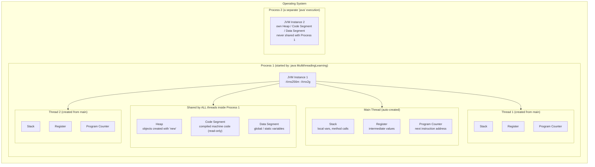

## [notes.md] The Process → JVM Instance → Threads Relationship (and Memory Model)

```mermaid
flowchart TB
    subgraph OS["Operating System"]
        direction LR
        subgraph P1["Process 1  (started by: java MultithreadingLearning)"]
            direction TB
            JVM1["JVM Instance 1<br/>-Xms256m -Xmx2g"]
            subgraph SHARED1["Shared by ALL threads inside Process 1"]
                HEAP1["Heap<br/>objects created with 'new'"]
                CODE1["Code Segment<br/>compiled machine code (read-only)"]
                DATA1["Data Segment<br/>global / static variables"]
            end
            subgraph MAIN["Main Thread (auto-created)"]
                STACK_M["Stack<br/>local vars, method calls"]
                REG_M["Register<br/>intermediate values"]
                PC_M["Program Counter<br/>next instruction address"]
            end
            subgraph T1["Thread 1 (created from main)"]
                STACK_1["Stack"]
                REG_1["Register"]
                PC_1["Program Counter"]
            end
            subgraph T2["Thread 2 (created from main)"]
                STACK_2["Stack"]
                REG_2["Register"]
                PC_2["Program Counter"]
            end
            JVM1 --> SHARED1
            JVM1 --> MAIN
            JVM1 --> T1
            JVM1 --> T2
        end
        subgraph P2["Process 2 (a separate 'java' execution)"]
            JVM2["JVM Instance 2<br/>own Heap / Code Segment / Data Segment<br/>never shared with Process 1"]
        end
    end
```
