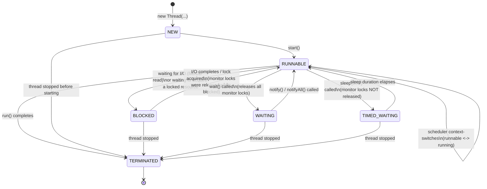

## [notes.md] Java Thread Lifecycle (State Machine)

```mermaid
stateDiagram-v2
    [*] --> NEW: new Thread(...)
    NEW --> RUNNABLE: start()

    RUNNABLE --> RUNNABLE: scheduler context-switches\n(runnable <-> running)

    RUNNABLE --> BLOCKED: waiting for I/O (file/DB read)\nor waiting to acquire a locked resource
    BLOCKED --> RUNNABLE: I/O completes / lock acquired\n(monitor locks were released while blocked)

    RUNNABLE --> WAITING: wait() called\n(releases all monitor locks)
    WAITING --> RUNNABLE: notify() / notifyAll() called

    RUNNABLE --> TIMED_WAITING: sleep(time) called\n(monitor locks NOT released)
    TIMED_WAITING --> RUNNABLE: sleep duration elapses

    RUNNABLE --> TERMINATED: run() completes
    NEW --> TERMINATED: thread stopped before starting
    BLOCKED --> TERMINATED: thread stopped
    WAITING --> TERMINATED: thread stopped
    TIMED_WAITING --> TERMINATED: thread stopped
    TERMINATED --> [*]
```
