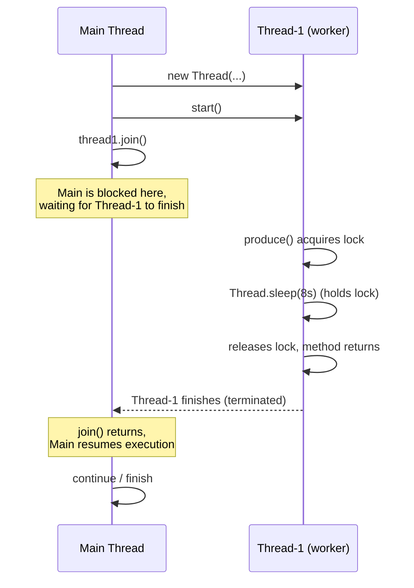

## [notes.md] Thread Joining and Daemon Shutdown Behavior — Diagram 1 (Thread Joining)



## [notes.md] Thread Joining and Daemon Shutdown Behavior — Diagram 2 (Daemon Shutdown)

```mermaid
sequenceDiagram
    participant Main as Main Thread (user thread)
    participant D as Daemon Thread

    Main->>D: new Thread(...); setDaemon(true)
    Main->>D: start()
    par Daemon runs in background
        D->>D: produce() acquires lock
        D->>D: Thread.sleep(8s) (in progress...)
    and Main finishes its own work
        Main->>Main: finishes remaining statements
    end
    Note over Main: Last user thread (Main) has<br/>completed execution
    Main-->>D: JVM exits immediately
    Note over D: Daemon thread is killed mid-task —<br/>sleep never completes, lock never released,<br/>no cleanup happens
```
