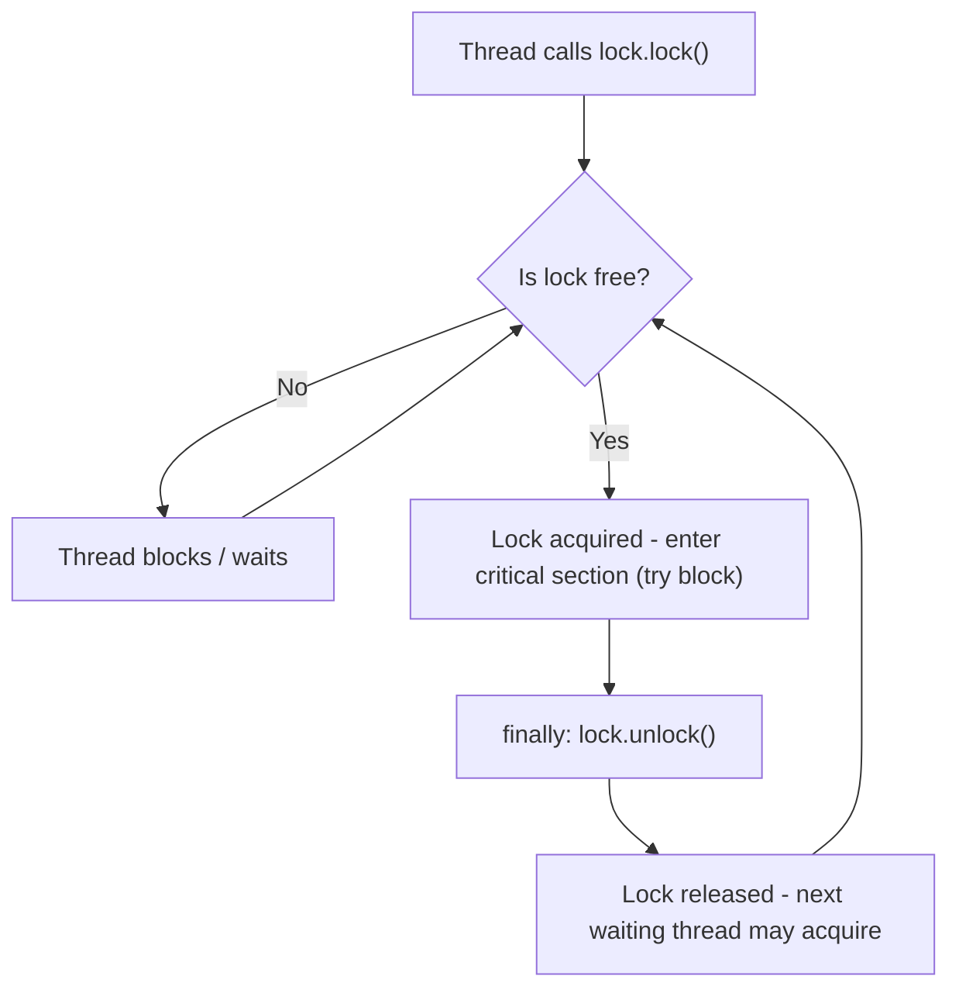
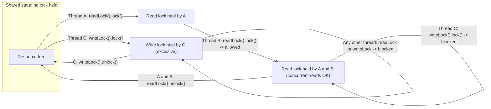

## [notes.md] Lock Acquisition / Release Flow (ReentrantLock)

```mermaid
flowchart TD
    A["Thread calls lock.lock()"] --> B{"Is lock free?"}
    B -- No --> C["Thread blocks / waits"]
    C --> B
    B -- Yes --> D["Lock acquired - enter critical section (try block)"]
    D --> E["finally: lock.unlock()"]
    E --> F["Lock released - next waiting thread may acquire"]
    F --> B
```

## [notes.md] ReadWriteLock Concurrency: Multiple Readers vs Exclusive Writer

```mermaid
flowchart LR
    subgraph Shared["Shared state: no lock held"]
        S0["Resource free"]
    end
    S0 -->|"Thread A: readLock().lock()"| RA["Read lock held by A"]
    RA -->|"Thread B: readLock().lock() -> allowed"| RAB["Read lock held by A and B (concurrent reads OK)"]
    RAB -->|"Thread C: writeLock().lock() -> blocked"| RAB
    RAB -->|"A and B: readLock().unlock()"| S0
    S0 -->|"Thread C: writeLock().lock()"| WC["Write lock held by C (exclusive)"]
    WC -->|"Any other thread: readLock or writeLock -> blocked"| WC
    WC -->|"C: writeLock().unlock()"| S0
```
