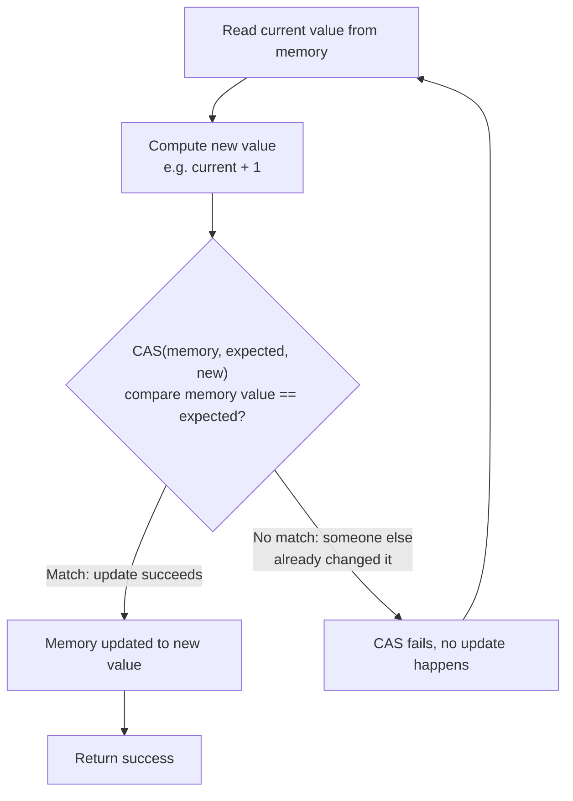

## [notes.md] How Compare-And-Swap (CAS) Works — The Retry Loop

```mermaid
flowchart TD
    A[Read current value from memory] --> B[Compute new value<br/>e.g. current + 1]
    B --> C{"CAS(memory, expected, new)<br/>compare memory value == expected?"}
    C -- "Match: update succeeds" --> D[Memory updated to new value]
    D --> E[Return success]
    C -- "No match: someone else<br/>already changed it" --> F[CAS fails, no update happens]
    F --> A
```
