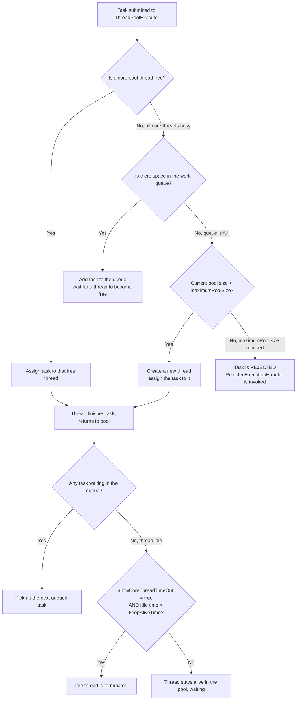

## [notes.md] Task Submission Flow (ThreadPoolExecutor)

```mermaid
flowchart TD
    A[Task submitted to ThreadPoolExecutor] --> B{Is a core pool thread free?}
    B -->|Yes| C[Assign task to that free thread]
    B -->|No, all core threads busy| D{Is there space in the work queue?}
    D -->|Yes| E[Add task to the queue<br/>wait for a thread to become free]
    D -->|No, queue is full| F{Current pool size < maximumPoolSize?}
    F -->|Yes| G[Create a new thread<br/>assign the task to it]
    F -->|No, maximumPoolSize reached| H[Task is REJECTED<br/>RejectedExecutionHandler is invoked]
    C --> I[Thread finishes task, returns to pool]
    G --> I
    I --> J{Any task waiting in the queue?}
    J -->|Yes| K[Pick up the next queued task]
    J -->|No, thread idle| L{allowCoreThreadTimeOut = true<br/>AND idle time > keepAliveTime?}
    L -->|Yes| M[Idle thread is terminated]
    L -->|No| N[Thread stays alive in the pool, waiting]
```
