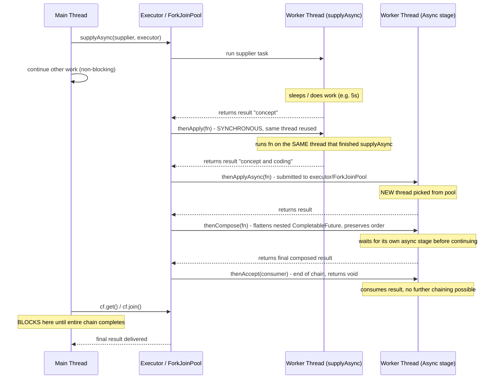

## [notes.md] CompletableFuture Chaining — Sequence Diagram

```mermaid
sequenceDiagram
    participant Main as Main Thread
    participant Pool as Executor / ForkJoinPool
    participant T1 as Worker Thread (supplyAsync)
    participant T2 as Worker Thread (Async stage)

    Main->>Pool: supplyAsync(supplier, executor)
    Pool->>T1: run supplier task
    Main->>Main: continue other work (non-blocking)
    Note over T1: sleeps / does work (e.g. 5s)
    T1-->>Pool: returns result "concept"

    Pool->>T1: thenApply(fn) - SYNCHRONOUS, same thread reused
    Note over T1: runs fn on the SAME thread that finished supplyAsync
    T1-->>Pool: returns result "concept and coding"

    Pool->>T2: thenApplyAsync(fn) - submitted to executor/ForkJoinPool
    Note over T2: NEW thread picked from pool
    T2-->>Pool: returns result

    Pool->>T2: thenCompose(fn) - flattens nested CompletableFuture, preserves order
    Note over T2: waits for its own async stage before continuing
    T2-->>Pool: returns final composed result

    Pool->>T2: thenAccept(consumer) - end of chain, returns void
    Note over T2: consumes result, no further chaining possible

    Main->>Pool: cf.get() / cf.join()
    Note over Main: BLOCKS here until entire chain completes
    Pool-->>Main: final result delivered
```
