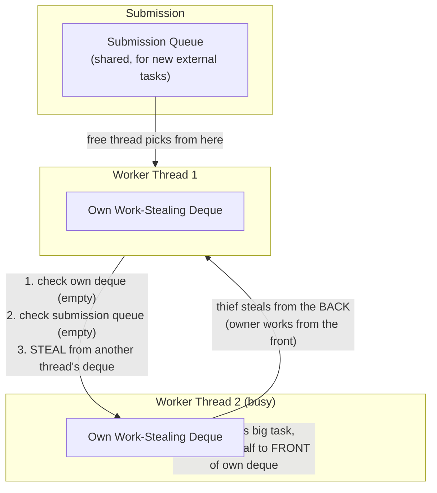

# Mermaid Diagrams — 36_ForkJoinPool_WorkStealingPool_AllThreadPoolTypes

## [notes.md] How Work-Stealing Actually Works

```mermaid
flowchart TD
    subgraph Submission
        SQ["Submission Queue<br/>(shared, for new external tasks)"]
    end
    subgraph Thread1["Worker Thread 1"]
        D1["Own Work-Stealing Deque"]
    end
    subgraph Thread2["Worker Thread 2 (busy)"]
        D2["Own Work-Stealing Deque"]
    end

    SQ -->|"free thread picks from here"| Thread1
    Thread2 -->|"fork() splits big task,<br/>pushes 2nd half to FRONT of own deque"| D2
    Thread1 -->|"1. check own deque (empty)<br/>2. check submission queue (empty)<br/>3. STEAL from another thread's deque"| D2
    D2 -->|"thief steals from the BACK<br/>(owner works from the front)"| Thread1
```
