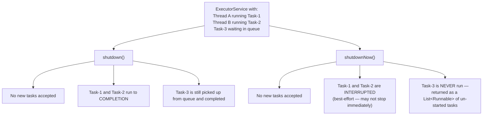

## [notes.md] Shutdown Behavior Comparison

```mermaid
flowchart TD
    A["ExecutorService with:<br/>Thread A running Task-1<br/>Thread B running Task-2<br/>Task-3 waiting in queue"] --> B["shutdown()"]
    A --> C["shutdownNow()"]

    B --> B1["No new tasks accepted"]
    B --> B2["Task-1 and Task-2 run to COMPLETION"]
    B --> B3["Task-3 is still picked up from queue and completed"]

    C --> C1["No new tasks accepted"]
    C --> C2["Task-1 and Task-2 are INTERRUPTED<br/>(best-effort — may not stop immediately)"]
    C --> C3["Task-3 is NEVER run —<br/>returned as a List&lt;Runnable&gt; of un-started tasks"]
```
