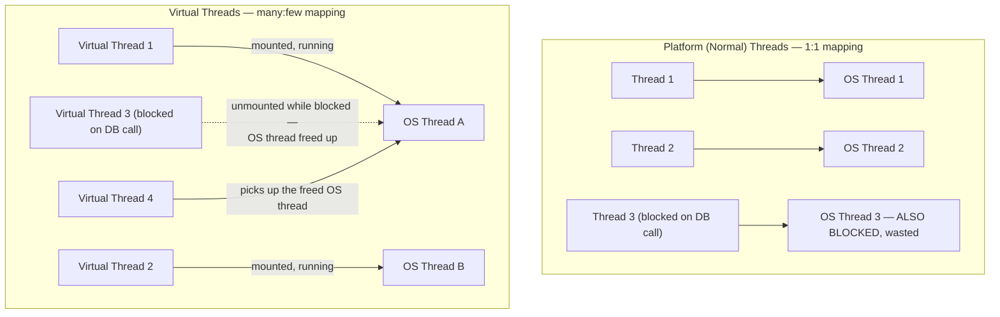

## [notes.md] Platform Threads vs Virtual Threads

```mermaid
flowchart TB
    subgraph Platform["Platform (Normal) Threads — 1:1 mapping"]
        PT1[Thread 1] --> OS1[OS Thread 1]
        PT2[Thread 2] --> OS2[OS Thread 2]
        PT3["Thread 3 (blocked on DB call)"] --> OS3["OS Thread 3 — ALSO BLOCKED, wasted"]
    end

    subgraph Virtual["Virtual Threads — many:few mapping"]
        VT1[Virtual Thread 1]
        VT2[Virtual Thread 2]
        VT3["Virtual Thread 3 (blocked on DB call)"]
        VT4[Virtual Thread 4]
        OSV1["OS Thread A"]
        OSV2["OS Thread B"]

        VT1 -->|mounted, running| OSV1
        VT2 -->|mounted, running| OSV2
        VT3 -.->|"unmounted while blocked —<br/>OS thread freed up"| OSV1
        VT4 -->|"picks up the freed OS thread"| OSV1
    end
```
