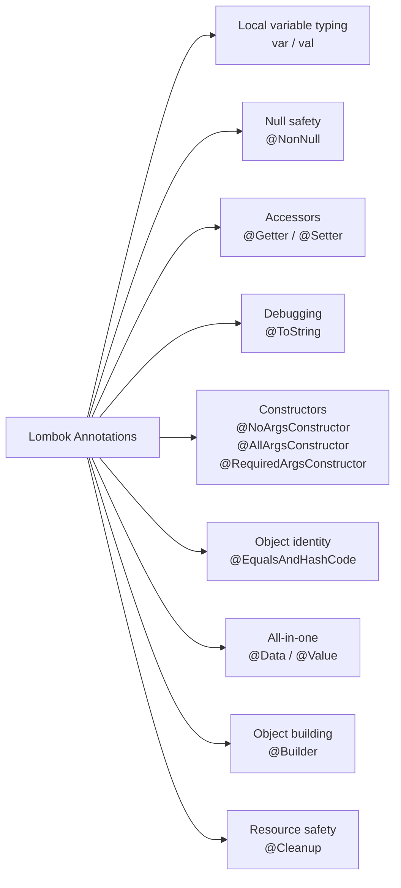

## [notes.md] The Annotation Catalog

```mermaid
flowchart LR
    A["Lombok Annotations"] --> B["Local variable typing<br/>var / val"]
    A --> C["Null safety<br/>@NonNull"]
    A --> D["Accessors<br/>@Getter / @Setter"]
    A --> E["Debugging<br/>@ToString"]
    A --> F["Constructors<br/>@NoArgsConstructor<br/>@AllArgsConstructor<br/>@RequiredArgsConstructor"]
    A --> G["Object identity<br/>@EqualsAndHashCode"]
    A --> H["All-in-one<br/>@Data / @Value"]
    A --> I["Object building<br/>@Builder"]
    A --> J["Resource safety<br/>@Cleanup"]
```
