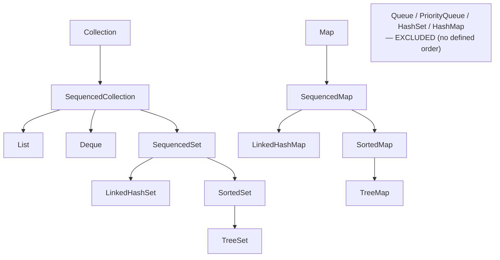

# Mermaid Diagrams — 40_Java21_SequencedCollections

## [notes.md] The New Hierarchy

```mermaid
flowchart TD
    Collection --> SequencedCollection
    SequencedCollection --> List
    SequencedCollection --> Deque
    SequencedCollection --> SequencedSet
    SequencedSet --> LinkedHashSet
    SequencedSet --> SortedSet
    SortedSet --> TreeSet

    Map --> SequencedMap
    SequencedMap --> LinkedHashMap
    SequencedMap --> SortedMap
    SortedMap --> TreeMap

    Q["Queue / PriorityQueue / HashSet / HashMap<br/>— EXCLUDED (no defined order)"]
```
