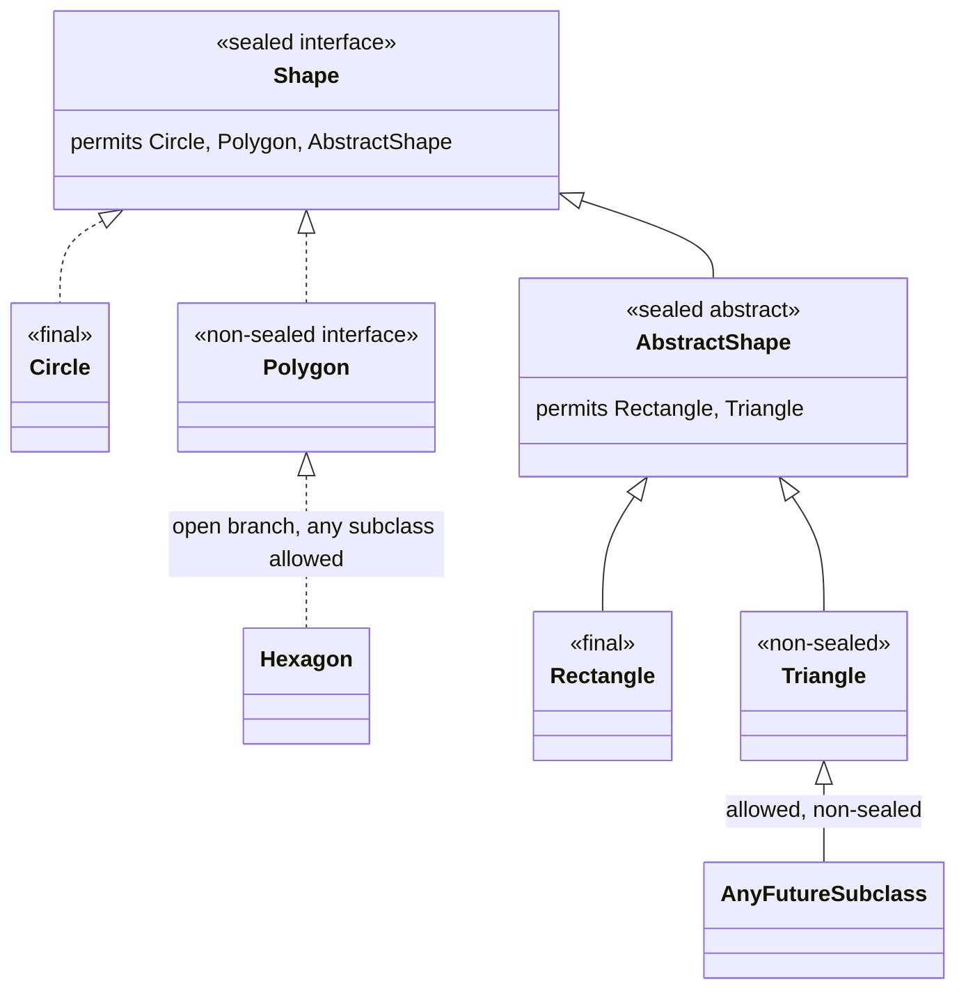

## [notes.md] Mixed Hierarchy Example

```mermaid
classDiagram
    class Shape {
        <<sealed interface>>
        permits Circle, Polygon, AbstractShape
    }
    class Circle {
        <<final>>
    }
    class Polygon {
        <<non-sealed interface>>
    }
    class Hexagon
    class AbstractShape {
        <<sealed abstract>>
        permits Rectangle, Triangle
    }
    class Rectangle {
        <<final>>
    }
    class Triangle {
        <<non-sealed>>
    }

    Shape <|.. Circle
    Shape <|.. Polygon
    Polygon <|.. Hexagon : open branch, any subclass allowed
    Shape <|-- AbstractShape
    AbstractShape <|-- Rectangle
    AbstractShape <|-- Triangle
    Triangle <|-- AnyFutureSubclass : allowed, non-sealed
```
