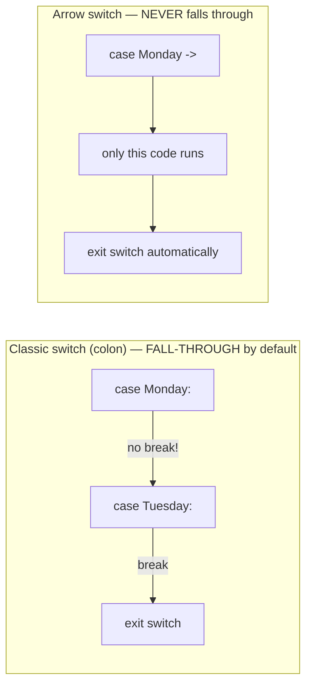

# Mermaid Diagrams — 42_Java14_Switch_Enhancements

## [notes.md] Fall-Through Behavior: Old vs New

```mermaid
flowchart LR
    subgraph Old["Classic switch (colon) — FALL-THROUGH by default"]
        A["case Monday:"] -->|"no break!"| B["case Tuesday:"]
        B -->|"break"| C[exit switch]
    end
    subgraph New["Arrow switch — NEVER falls through"]
        D["case Monday ->"] --> E["only this code runs"]
        E --> F[exit switch automatically]
    end
```
