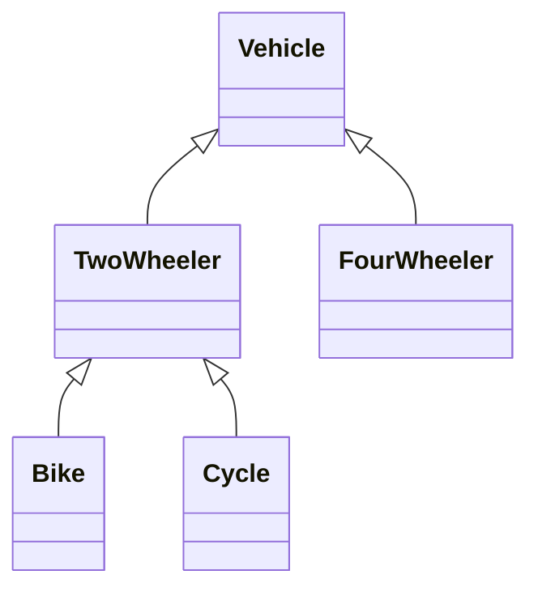

# Mermaid Diagrams — Java 21 Pattern Matching for `switch`

## [notes.md] Works across a class hierarchy — with exhaustiveness rules

```mermaid
classDiagram
    Vehicle <|-- TwoWheeler
    Vehicle <|-- FourWheeler
    TwoWheeler <|-- Bike
    TwoWheeler <|-- Cycle
```
