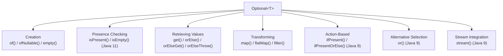

## [notes.md] Optional Method Categories

```mermaid
flowchart TD
    O["Optional&lt;T&gt;"] --> C["Creation<br/>of() / ofNullable() / empty()"]
    O --> P["Presence Checking<br/>isPresent() / isEmpty() (Java 11)"]
    O --> R["Retrieving Values<br/>get() / orElse() / orElseGet() / orElseThrow()"]
    O --> T["Transforming<br/>map() / flatMap() / filter()"]
    O --> A["Action-Based<br/>ifPresent() / ifPresentOrElse() (Java 9)"]
    O --> S2["Alternative Selection<br/>or() (Java 9)"]
    O --> S["Stream Integration<br/>stream() (Java 9)"]
```
