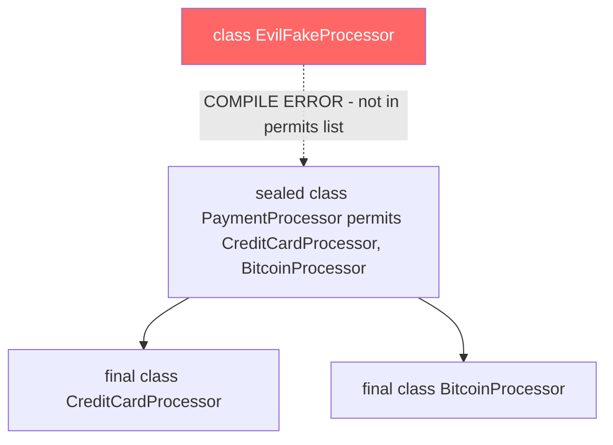

## [Q7_sealed_classes.md] Sealed Class Hierarchy (Mermaid)

```mermaid
flowchart TD
    PP["sealed class PaymentProcessor permits CreditCardProcessor, BitcoinProcessor"] --> CCP["final class CreditCardProcessor"]
    PP --> BCP["final class BitcoinProcessor"]
    Evil["class EvilFakeProcessor"] -.->|"COMPILE ERROR - not in permits list"| PP
    style Evil fill:#f66,color:#fff
```
