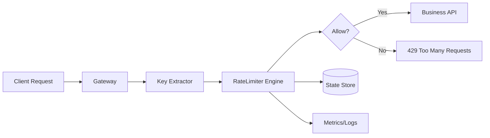

## [01_Rate_Limiter_PRINT.md] Extra Visual 1 (Mermaid)

```mermaid
flowchart LR
        A[Client Request] --> B[Gateway]
        B --> C[Key Extractor]
        C --> D[RateLimiter Engine]
        D --> E{Allow?}
        E -->|Yes| F[Business API]
        E -->|No| G[429 Too Many Requests]
        D --> H[(State Store)]
        D --> I[Metrics/Logs]
```
