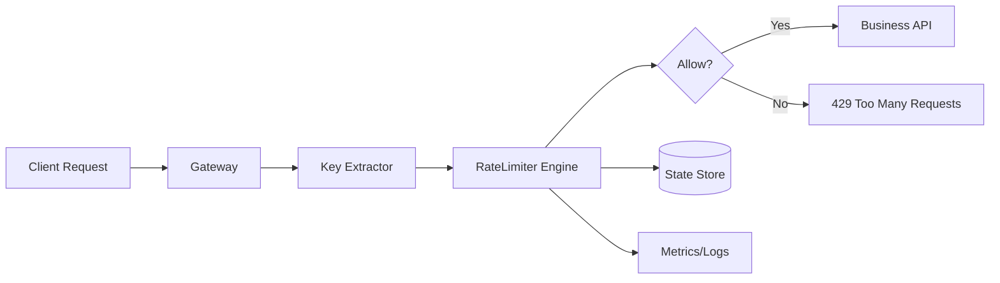

# Rate Limiter - Complete LLD Interview Guide

**Interview Duration: 45 minutes | Difficulty: Medium | Must-Know: ⭐⭐⭐**

**Print version tip:** keep it conversational. In a senior round, start from the request path, explain the trade-offs, then show only the core token bucket code.

---

## NEW LEARNER ADD-ON (12-YEAR INTERVIEW SCRIPT)

Use this section first if you want very simple English and ready-to-speak lines.

### 1) Easy Start Script

Interviewer: "Design a rate limiter."

You:
"Sure. I will keep this simple."
"First I decide who to limit. Then I run allow/deny check. Then I store state safely."

"My goals are:"
- block too many requests early
- keep request latency low
- avoid race conditions
- support single node now and distributed mode later

### 2) 30-Second Architecture

```text
Client -> API Gateway -> RateLimiter -> allow or 429
                               |
                               +-> state store (memory/Redis)
                               +-> metrics/logs
```

Say this:
"I put rate limiter before business API. So bad traffic is rejected early and backend stays protected."

### 3) Component Purpose (Easy English)

```text
1) Key extractor
What: picks key like userId, apiKey, tenantId, or IP.
Why: limiter works only when requests are grouped by identity.

2) Limiter engine
What: runs algorithm and returns true/false.
Why: caller only needs one decision.

3) Algorithm module
What: token bucket / sliding window / others.
Why: choose behavior based on burst and fairness needs.

4) State store
What: stores tokens/counters/timestamps.
Why: correct state is required for correct throttling.

5) Config
What: per-API and per-tenant limits.
Why: one global limit is not realistic in production.

6) Metrics and logs
What: track allowed, denied, and queueing pain points.
Why: without visibility, you cannot tune safely.

7) Cleanup (TTL)
What: remove old keys.
Why: prevents memory leak and stale state growth.
```

### 4) Extra Visual 1 (Mermaid)



### 5) Extra Visual 2 (ASCII Sequence)

```text
Client      Gateway      Limiter      Store       API
    |            |            |           |          |
    |--request-->|            |           |          |
    |            |--check---->|--read---->|          |
    |            |            |<--state---|          |
    |            |            |--update-->|          |
    |            |<--allow----|           |          |
    |            |------------------------------->    |
    |<--200------|                                    |

If denied:
Client <---429--- Gateway <---deny--- Limiter
```

Say this:
"Important rule: check and update should be atomic. Otherwise concurrent requests can bypass limits."

### 6) Why I Choose Token Bucket First

```text
Reason 1: allows controlled bursts
Reason 2: simple mental model for interviews
Reason 3: practical for API traffic
Reason 4: easy migration to Redis-backed distributed mode
```

Interview line:
"Token bucket is my default choice. If I need stricter fairness, I switch to sliding-window options."

### 7) Design Choice Justification (Interviewer-Friendly)

```text
Design choice: Strategy Pattern
Purpose: switch algorithm without changing gateway integration.
Interview line: "Traffic policy evolves, so algorithm must be swappable."

Design choice: Factory
Purpose: instantiate algorithm by config.
Interview line: "I keep selection logic out of the caller."

Design choice: In-memory first, Redis later
Purpose: start simple, then scale safely.
Interview line: "Single node first; distributed only when needed."

Design choice: TTL cleanup
Purpose: avoid unbounded state growth.
Interview line: "A limiter that leaks state becomes an outage source."
```

### 8) Practical Failure Handling Script

Interviewer: "What can fail in production?"

You:
"Mostly state consistency and coordination issues."

```text
Case A: Store outage
- fallback policy: fail-open for non-critical APIs, fail-closed for sensitive APIs

Case B: Hot key traffic
- per-key partitioning and stricter per-tenant limits

Case C: Clock drift across nodes
- prefer store-time/monotonic strategy in distributed mode

Case D: Memory growth
- TTL eviction + cleanup scheduler
```

### 9) What I Implement in 20 Minutes (Concise)

```text
1) RateLimiter interface
2) TokenBucket implementation
3) One alternate implementation (SlidingWindowLog)
4) Factory for algorithm selection
5) Short demo: allow/deny behavior
```

Interview line:
"In short, I show decision logic, algorithm swap ability, and scaling path. That is enough for a strong interview answer."

### 10) Quick Whiteboard Close (30 seconds)

```text
Extract key -> check+update state atomically -> allow or 429
Use token bucket by default
Track metrics, clean stale state, scale with Redis when distributed
```

One-line close:
"Small API, correct concurrency behavior, and clear scale path."

---

## 🏗️ SENIOR INTERVIEW STARTER

**You:** "I would place the rate limiter before the business logic so bad traffic is rejected early. For a single node, I can keep the state in memory. For a distributed system, I would move the state to Redis or another shared store."

```text
Client
  |
  v
API Gateway
  |
  v
Rate Limiter  --->  Redis / in-memory store
  |
  +--> allow request
  +--> return 429 Too Many Requests
```

**You:** "The core question is simple: allow or deny. The rest is about state management, thread safety, and how much burst traffic I want to permit."

---

## 🎯 WHAT TO ACTUALLY WRITE IN INTERVIEW

**✅ MUST WRITE ON WHITEBOARD/SCREEN:**

### 1. Core Interface - RateLimiter
```java
public interface RateLimiter {
    boolean allowRequest(String key);
}
```

**Say this:** "I keep the interface tiny because the caller only needs one decision from the limiter."

### 2. Token Bucket Algorithm - Main Choice
```java
public class TokenBucketRateLimiter implements RateLimiter {
    private final int capacity;
    private final int refillRate;
    private final Map<String, Bucket> buckets;

    private static class Bucket {
        double tokens;
        long lastRefillTime;
        final int capacity;

        Bucket(int capacity) {
            this.capacity = capacity;
            this.tokens = capacity;
            this.lastRefillTime = System.currentTimeMillis();
        }

        void refill(int refillRate) {
            long now = System.currentTimeMillis();
            long elapsedMs = now - lastRefillTime;
            double tokensToAdd = (elapsedMs / 1000.0) * refillRate;
            tokens = Math.min(capacity, tokens + tokensToAdd);
            lastRefillTime = now;
        }
    }

    public TokenBucketRateLimiter(int capacity, int refillRate) {
        this.capacity = capacity;
        this.refillRate = refillRate;
        this.buckets = new ConcurrentHashMap<>();
    }

    @Override
    public synchronized boolean allowRequest(String key) {
        Bucket bucket = buckets.computeIfAbsent(key, k -> new Bucket(capacity));
        bucket.refill(refillRate);

        if (bucket.tokens > 0) {
            bucket.tokens--;
            return true;
        }
        return false;
    }

    @Override
    public void reset(String key) {
        buckets.remove(key);
    }
}
```

**Say this:** "Token bucket is my default choice because it allows bursts, is easy to explain, and fits API throttling well."

### 3. One Alternative - Sliding Window Log
```java
public class SlidingWindowLogRateLimiter implements RateLimiter {
    private final int limit;
    private final long windowMs;
    private final Map<String, LinkedList<Long>> requestLog;

    public SlidingWindowLogRateLimiter(int limit, long windowMs) {
        this.limit = limit;
        this.windowMs = windowMs;
        this.requestLog = new ConcurrentHashMap<>();
    }

    @Override
    public synchronized boolean allowRequest(String key) {
        long now = System.currentTimeMillis();
        LinkedList<Long> timestamps = requestLog.computeIfAbsent(key, k -> new LinkedList<>());

        while (!timestamps.isEmpty() && timestamps.getFirst() <= now - windowMs) {
            timestamps.removeFirst();
        }

        if (timestamps.size() < limit) {
            timestamps.add(now);
            return true;
        }
        return false;
    }
}
```

**Say this:** "I only show one alternative to prove I understand the trade-off. Sliding window log is accurate, but it stores more timestamps."

**🗣️ EXPLAIN VERBALLY:**
- "Leaky bucket smooths traffic when I do not want bursts."
- "Fixed window is the simplest, but it can burst at the window boundary."
- "Sliding window counter is a practical compromise between memory and accuracy."
- "For distributed rate limiting, I would use Redis with atomic increment or sorted-set logic and expiry."

### Quick ASCII View

```text
Token Bucket
  tokens refill over time
  request consumes 1 token

Sliding Window Log
  keep recent timestamps
  remove old entries
  count what is inside the window
```

---

## CONVERSATIONAL SCRIPT

### Phase 1: Requirements Clarification

**You:** "Let me clarify the scope first. I want to know what is being limited and whether the limiter lives in the gateway or inside the service."

**Functional Requirements:**
- "Limit requests per user, IP, or API key in a time window."
- "Support different limits for different APIs or tenants."
- "Return allow or deny for each request."
- "Handle burst traffic if the product needs it."

**Interviewer:** "Yes, and it should work across multiple servers too."

**You:** "Then I would call out low latency, thread safety, memory efficiency, and a distributed design if we need more than one node."

**Interviewer:** "Focus on the algorithms and trade-offs."

### Phase 2: Rate Limiting Algorithms

**You:** "There are a few standard algorithms, and I would choose based on the traffic pattern, not just on implementation simplicity."

```text
Algorithm summary
-----------------
Token Bucket: best default, allows bursts
Leaky Bucket: smooth output, no bursts
Fixed Window: simplest, but bursty at edges
Sliding Window Log: most accurate, higher memory
Sliding Window Counter: practical compromise
```

**You:** "For most production APIs, I would start with token bucket. If the interviewer asks for fairness or tighter accuracy, I would bring up sliding window."

### Phase 3: Class Design

**You:** "For the class design, I keep the interface tiny and let each algorithm own its own state."

```text
RateLimiter (interface)
  + allowRequest(key)
  + reset(key)

TokenBucketRateLimiter
FixedWindowRateLimiter
SlidingWindowLogRateLimiter
SlidingWindowCounterRateLimiter

RateLimiterFactory
DistributedRateLimiter
RateLimiterConfig
```

**You:** "That split is deliberate: the API layer stays stable, the limiter implementation stays swappable, and the distributed version only changes the backing store."

---

## CORE IMPLEMENTATION TALK TRACK

### 1. RateLimiterConfig

**What I say:** "I keep the config explicit so the same limiter can be reused for per-second, per-minute, or per-hour limits."

### 2. Token Bucket

**What I say:** "I use a per-key bucket so each user or API key is isolated. The refill is time-based, and each request consumes one token."

### 3. Fixed Window

**What I say:** "This is the simplest baseline, but I only mention it to explain the boundary burst problem."

### 4. Sliding Window Log

**What I say:** "This is accurate because I store timestamps, but I pay for that accuracy in memory."

### 5. Sliding Window Counter

**What I say:** "This is the practical compromise. It is lighter than full logs and more fair than fixed windows."

### 6. Factory Pattern

**What I say:** "I keep algorithm selection out of the caller so I can switch strategies without touching the gateway or the service layer."

### 7. Distributed Rate Limiter

**What I say:** "For distributed rate limiting, I would use Redis with atomic increment or a sorted-set approach, plus expiry so the keys do not grow forever."

**If needed:** "In real life I would use a Lua script or another atomic Redis operation so the check and update happen together."

---

## USAGE DEMO TALK TRACK

**You:** "I would not walk through every test line by line. I would use a short demo to show that the same interface works with different algorithms."

```text
Demo flow
---------
1. Create limiter with config
2. Call allowRequest() repeatedly
3. Show allowed vs denied
4. Swap algorithm and repeat
5. If distributed, mention Redis-backed state
```

---

## ALGORITHM COMPARISON

```text
Scenario                          Best Choice
----------------------------------------------
General API rate limiting         Token Bucket
Strict no-burst requirement       Leaky Bucket
High performance needed           Fixed Window
Perfect accuracy required         Sliding Window Log
Balance of all factors            Sliding Window Counter
Distributed system                Redis + atomic counter or sorted set
```

---

## SOLID PRINCIPLES IN DEPTH

**You:** "I would keep SOLID short: the limiter enforces policy, storage keeps state, the factory chooses the algorithm, and the gateway depends on the limiter interface."

**Say this:**
- "SRP: limiter policy, storage, and metrics are separate concerns."
- "OCP: new algorithms come in as new classes, not edits to the gateway."
- "LSP: every limiter returns the same boolean contract."
- "ISP: optional capabilities like reset or metrics should stay separate."
- "DIP: the gateway depends on RateLimiter, not a concrete limiter class."

---

## KEY TAKEAWAYS

### Design Patterns
✅ **Strategy Pattern** - Different algorithms like token bucket or sliding window
✅ **Factory Pattern** - Create limiters based on config
✅ **Distributed State** - Redis or another shared store when scaling horizontally

### Practical Choices
✅ **Token Bucket** - Best default for APIs because it handles bursts
✅ **Sliding Window Log** - Most accurate, but heavier on memory
✅ **Fixed Window** - Easiest to explain, but boundary bursts are a real drawback
✅ **Leaky Bucket** - Good when output must stay smooth

### Interview Lines
✅ "I would start with token bucket for most systems."
✅ "If the interviewer wants fairness, I would discuss sliding window."
✅ "For distributed systems, I would move the state into Redis."
✅ "I keep the contract small: allowRequest only."

---

## COMMON MISTAKES TO AVOID

- Not making the limiter thread-safe.
- Forgetting to clean up old state and leaking memory.
- Ignoring the boundary burst problem in fixed windows.
- Not mentioning distributed coordination.
- Overengineering the interface when a boolean is enough.

---

## REAL-WORLD APPLICATIONS

✅ **API Rate Limiting** - Public and internal APIs
✅ **Login Attempts** - Brute-force protection
✅ **DDoS Protection** - Edge gateways and WAFs
✅ **Resource Throttling** - Databases, background jobs, and queues
✅ **Cost Control** - Cloud API usage control

---

**END OF RATE LIMITER GUIDE**

This version is meant for speaking, not reading line by line.