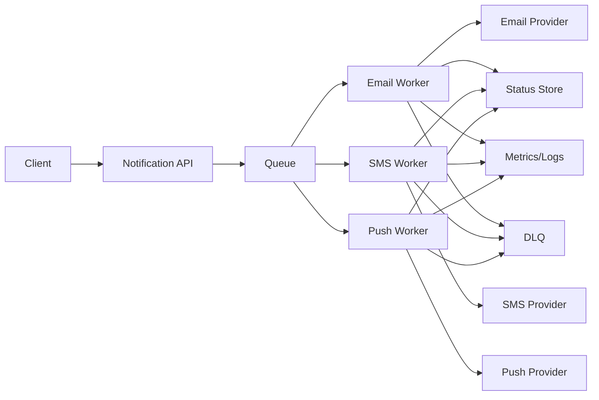

# Notification Service - Complete LLD Interview Guide

**Interview Duration: 45 minutes | Difficulty: Medium | Must-Know: ⭐⭐⭐**

**Print version tip:** keep the code snippets short and let the spoken script do the heavy lifting. If you are presenting this in a senior round, lead with the architecture, then explain the flow in a natural conversation.

---

## NEW LEARNER ADD-ON (12-YEAR INTERVIEW SCRIPT)

Use this section first if you want simple English and clear speaking flow.

### 1) Easy Start Script

Interviewer: "Design a notification service."

You:
"Sure. I will keep this simple."
"I will explain request intake, background delivery, failure handling, and monitoring."

"My goals are:"
- API should respond fast
- notifications should not be lost
- retries should be safe
- new channels should be easy to add

### 2) 30-Second Architecture

```text
Client -> Notification API -> Queue -> Workers -> Provider APIs
                                                                            |
                                                                            +-> Status Store + Metrics + DLQ
```

Say this:
"The API accepts the request and returns quickly. Real sending happens in workers. This keeps API fast and makes retries safe."

### 3) Component Purpose (Easy English)

```text
1) Notification API
What: accepts request and does basic validation.
Why: caller should not wait for email or SMS provider response.

2) Queue
What: stores notification jobs.
Why: handles traffic spikes and keeps jobs safe if workers are busy.

3) Workers
What: read jobs from queue and send to providers.
Why: decouples sending from API and allows horizontal scaling.

4) Channel Sender (Email/SMS/Push)
What: channel-specific code.
Why: each provider has different API and error behavior.

5) Retry Policy
What: decides retry count and delay.
Why: temporary failures are common; retries should be controlled.

6) DLQ
What: stores jobs that failed too many times.
Why: prevents infinite retry loops and enables manual replay.

7) Status Store
What: keeps states like QUEUED, SENT, FAILED.
Why: support team must answer "what happened to this notification?"

8) Metrics/Logs
What: track success rate, queue lag, provider errors.
Why: helps detect problems early in production.
```

### 4) Extra Visual 1 (Mermaid)



### 5) Extra Visual 2 (ASCII Sequence)

```text
Client      API       Queue      Worker     Provider    StatusDB
    |          |          |           |           |           |
    |--POST--->|          |           |           |           |
    |<-202-----|          |           |           |           |
    |          |--push--->|           |           |           |
    |          |          |--pull---->|           |           |
    |          |          |           |--send---->|           |
    |          |          |           |<--resp----|           |
    |          |          |           |--update--------------->|
```

Say this:
"I return 202 from API because delivery is async. This is normal in notification systems."

### 6) Why These Design Choices

```text
Strategy Pattern for RetryPolicy:
- easy to switch retry logic without changing sender code.

Factory for Sender:
- easy to add new channel (like WhatsApp) without large if-else blocks.

Queue + DLQ:
- safer delivery and better failure isolation.

Observer for metrics/logging:
- keeps monitoring logic separate from sending logic.
```

Interview line:
"I keep business flow simple and move variability into pluggable policies and senders."

### 7) Failure Script (Simple)

Interviewer: "Provider is down. What do you do?"

You:
"Worker retries with backoff. After max retries, job goes to DLQ. API still works because queue decouples ingestion and delivery."

Interviewer: "How do you avoid duplicates?"

You:
"Use idempotency key and dedupe check before sending. Same request should not send twice."

### 8) What I Code in 20 Minutes

```text
1) NotificationSender interface
2) Email sender implementation
3) NotificationService with async queue
4) RetryPolicy (exponential backoff)
5) status update on success/failure
```

Interview line:
"This shows extensibility, reliability, and production thinking in minimum code."

### 9) Quick Close (30 Seconds)

```text
Fast API accept -> queue -> workers -> provider -> status update
Retries are bounded, failures go to DLQ, system is observable
```

One-line close:
"Simple design, safe retries, and clear operations."

### 10) Minimal Code You Can Actually Write (Interview Ready)

Use this exact order in interview so your code tells a clear story.

#### Step A: Enums + Models

```java
public enum NotificationType {
    EMAIL, SMS, PUSH
}

public enum NotificationStatus {
    QUEUED, SENT, FAILED
}

public class Recipient {
    private final String email;
    private final String phone;
    private final String deviceToken;

    public Recipient(String email, String phone, String deviceToken) {
        this.email = email;
        this.phone = phone;
        this.deviceToken = deviceToken;
    }

    public String getEmail() { return email; }
    public String getPhone() { return phone; }
    public String getDeviceToken() { return deviceToken; }
}

public class Notification {
    private final String id;
    private final String idempotencyKey;
    private final NotificationType type;
    private final Recipient recipient;
    private final String subject;
    private final String content;
    private NotificationStatus status;

    public Notification(String id, String idempotencyKey, NotificationType type,
                        Recipient recipient, String subject, String content) {
        this.id = id;
        this.idempotencyKey = idempotencyKey;
        this.type = type;
        this.recipient = recipient;
        this.subject = subject;
        this.content = content;
        this.status = NotificationStatus.QUEUED;
    }

    public String getId() { return id; }
    public String getIdempotencyKey() { return idempotencyKey; }
    public NotificationType getType() { return type; }
    public Recipient getRecipient() { return recipient; }
    public String getSubject() { return subject; }
    public String getContent() { return content; }
    public NotificationStatus getStatus() { return status; }
    public void setStatus(NotificationStatus status) { this.status = status; }
}
```

#### Step B: Sender Interface + One Concrete Sender

```java
public interface NotificationSender {
    NotificationType getSupportedType();
    boolean send(Notification notification);
}

public class EmailNotificationSender implements NotificationSender {
    @Override
    public NotificationType getSupportedType() {
        return NotificationType.EMAIL;
    }

    @Override
    public boolean send(Notification notification) {
        // In production this calls SES/SendGrid SDK.
        System.out.println("Sending EMAIL to " + notification.getRecipient().getEmail()
                + " | subject=" + notification.getSubject());
        return true;
    }
}
```

#### Step C: Retry Policy

```java
public interface RetryPolicy {
    boolean shouldRetry(int attempt);
    long delayMs(int attempt);
}

public class ExponentialBackoffRetry implements RetryPolicy {
    private final int maxAttempts;

    public ExponentialBackoffRetry(int maxAttempts) {
        this.maxAttempts = maxAttempts;
    }

    @Override
    public boolean shouldRetry(int attempt) {
        return attempt < maxAttempts;
    }

    @Override
    public long delayMs(int attempt) {
        return (long) Math.pow(2, attempt) * 1000L; // 1s, 2s, 4s...
    }
}
```

#### Step D: NotificationService (Async + Idempotency + Retry)

```java
import java.util.Map;
import java.util.Set;
import java.util.concurrent.*;

public class NotificationService {
    private final Map<NotificationType, NotificationSender> senders = new ConcurrentHashMap<>();
    private final BlockingQueue<Notification> queue = new LinkedBlockingQueue<>();
    private final RetryPolicy retryPolicy;

    // In production, use Redis/DB idempotency store.
    private final Set<String> processedKeys = ConcurrentHashMap.newKeySet();

    private final ExecutorService workerPool = Executors.newFixedThreadPool(4);

    public NotificationService(RetryPolicy retryPolicy) {
        this.retryPolicy = retryPolicy;
        startWorkers();
    }

    public void registerSender(NotificationSender sender) {
        senders.put(sender.getSupportedType(), sender);
    }

    // API layer can call this and return 202 Accepted quickly.
    public void sendAsync(Notification notification) {
        queue.offer(notification);
    }

    private void startWorkers() {
        for (int i = 0; i < 4; i++) {
            workerPool.submit(this::workerLoop);
        }
    }

    private void workerLoop() {
        while (!Thread.currentThread().isInterrupted()) {
            try {
                Notification n = queue.take();

                // Idempotency guard: do not process same request twice.
                if (!processedKeys.add(n.getIdempotencyKey())) {
                    continue;
                }

                NotificationSender sender = senders.get(n.getType());
                if (sender == null) {
                    n.setStatus(NotificationStatus.FAILED);
                    continue;
                }

                boolean sent = sendWithRetry(sender, n);
                n.setStatus(sent ? NotificationStatus.SENT : NotificationStatus.FAILED);

                // In production: persist status + emit metrics + push to DLQ if failed.
                System.out.println("notificationId=" + n.getId() + " status=" + n.getStatus());
            } catch (InterruptedException e) {
                Thread.currentThread().interrupt();
            }
        }
    }

    private boolean sendWithRetry(NotificationSender sender, Notification n) {
        int attempt = 0;
        while (true) {
            if (sender.send(n)) {
                return true;
            }

            if (!retryPolicy.shouldRetry(attempt)) {
                return false;
            }

            try {
                Thread.sleep(retryPolicy.delayMs(attempt));
            } catch (InterruptedException e) {
                Thread.currentThread().interrupt();
                return false;
            }
            attempt++;
        }
    }
}
```

#### Step E: Tiny Demo Main

```java
public class Demo {
    public static void main(String[] args) throws Exception {
        NotificationService service = new NotificationService(new ExponentialBackoffRetry(3));
        service.registerSender(new EmailNotificationSender());

        Notification n = new Notification(
                "n-1001",
                "idem-abc-1001",
                NotificationType.EMAIL,
                new Recipient("user@demo.com", null, null),
                "Welcome",
                "Hello from Notification Service"
        );

        service.sendAsync(n);
        Thread.sleep(1500);
    }
}
```

What to say after writing this:

- "This is the minimum production-shaped flow: async queue, sender abstraction, retry policy, idempotency guard, and status updates."
- "In distributed mode, I move queue/idempotency/status to Kafka or SQS plus Redis or DB."

#### Step F: Distributed Upgrade (Redis + Kafka + DLQ) Code Sketch

Use this when interviewer asks: "How do you scale this to multiple nodes?"

Architecture upgrade in one line:

```text
API nodes -> Kafka topic -> Worker group -> Provider APIs
             |                |
             +-> Redis        +-> Redis status + DLQ topic
```

##### F1) API node publishes to Kafka (fast 202)

```java
public class NotificationApiService {
    private final RedisIdempotencyStore idempotencyStore;
    private final KafkaProducer<String, NotificationEvent> producer;

    public ApiResponse submit(NotificationRequest req) {
        String key = req.getTenantId() + ":" + req.getIdempotencyKey();

        // SETNX + TTL makes idempotency safe across many API nodes.
        boolean first = idempotencyStore.tryAcquire(key, 24 * 3600);
        if (!first) {
            return ApiResponse.accepted("DUPLICATE_ACCEPTED", req.getRequestId());
        }

        NotificationEvent event = NotificationEvent.from(req);
        producer.send(new ProducerRecord<>("notifications.created", req.getTenantId(), event));

        return ApiResponse.accepted("QUEUED", req.getRequestId());
    }
}
```

##### F2) Worker group consumes Kafka (shared-nothing workers)

```java
public class NotificationWorker {
    private final RedisStatusStore statusStore;
    private final NotificationSenderRegistry senderRegistry;
    private final RetryPolicy retryPolicy;
    private final KafkaProducer<String, NotificationEvent> retryProducer;
    private final KafkaProducer<String, DlqEvent> dlqProducer;

    // @KafkaListener(topics = "notifications.created", groupId = "notification-workers")
    public void onMessage(NotificationEvent event) {
        NotificationSender sender = senderRegistry.get(event.getType());
        if (sender == null) {
            dlqProducer.send(new ProducerRecord<>("notifications.dlq",
                    event.getTenantId(), DlqEvent.of(event, "NO_SENDER")));
            return;
        }

        boolean sent = sender.send(event.toDomain());
        if (sent) {
            statusStore.markSent(event.getRequestId(), event.getTenantId());
            return;
        }

        int nextAttempt = event.getAttempt() + 1;
        if (retryPolicy.shouldRetry(nextAttempt)) {
            NotificationEvent retryEvent = event.withAttempt(nextAttempt)
                    .withVisibleAfterEpochMs(System.currentTimeMillis() + retryPolicy.delayMs(nextAttempt));
            retryProducer.send(new ProducerRecord<>("notifications.retry", event.getTenantId(), retryEvent));
            statusStore.markRetrying(event.getRequestId(), event.getTenantId(), nextAttempt);
        } else {
            dlqProducer.send(new ProducerRecord<>("notifications.dlq",
                    event.getTenantId(), DlqEvent.of(event, "MAX_RETRY_EXCEEDED")));
            statusStore.markFailed(event.getRequestId(), event.getTenantId());
        }
    }
}
```

##### F3) Redis idempotency store (atomic across nodes)

```java
public class RedisIdempotencyStore {
    private final JedisPool jedisPool;

    public boolean tryAcquire(String key, int ttlSeconds) {
        try (var jedis = jedisPool.getResource()) {
            // SET key value NX EX ttl
            String result = jedis.set("idem:" + key, "1", "NX", "EX", ttlSeconds);
            return "OK".equals(result);
        }
    }
}
```

##### F4) DLQ replay tool (manual or scheduled)

```java
public class DlqReplayService {
    private final KafkaConsumer<String, DlqEvent> dlqConsumer;
    private final KafkaProducer<String, NotificationEvent> mainProducer;

    public void replaySelected(Predicate<DlqEvent> filter) {
        for (DlqEvent dlq : pollBatch()) {
            if (!filter.test(dlq)) continue;
            NotificationEvent retry = dlq.toNotificationEvent().withAttempt(0);
            mainProducer.send(new ProducerRecord<>("notifications.created", retry.getTenantId(), retry));
        }
    }

    private List<DlqEvent> pollBatch() {
        // Pseudocode: read a controlled batch from notifications.dlq
        return List.of();
    }
}
```

##### F5) What to say in follow-up

- "Idempotency moved to Redis so duplicate requests are blocked across all API nodes, not just one node memory."
- "Kafka consumer group gives horizontal scaling; each partition is processed by only one worker in the group."
- "DLQ preserves failed messages for safe replay; we never silently drop notifications."
- "Status is in Redis/DB so any API node can answer current state."
- "This is the same design, upgraded from single-node state to shared distributed state."

---

## 🏗️ SYSTEM DESIGN VIEW FOR SENIOR INTERVIEWS

If the interviewer is expecting 12+ years experience, lead with the macro design first and then drop into class-level design.

### High-Level Architecture

```text
Client / App
     |
     v
API Gateway / Notification API
     |
     v
Notification Orchestrator
  |        |         |
  |        |         +--> Preferences / Subscription Store
  |        +--------------> Template Service
  +-----------------------> Dedup / Idempotency Store
     |
     v
Durable Queue / Event Bus
     |
     v
Worker Pool / Channel Consumers
  |        |         |
  |        |         +--> Push Provider (FCM / APNS)
  |        +--------------> SMS Provider (Twilio)
  +-----------------------> Email Provider (SES / SendGrid)
     |
     v
Status DB / Audit Log / Metrics / Dead Letter Queue
```

### Delivery Flow

```text
Create Notification
    |
    v
Validate + Enrich + Render Template
    |
    v
Check Preference + Idempotency + Rate Limit
    |
    v
Publish Event to Queue
    |
    v
Worker Picks Job
    |
    v
Call Provider API
    |
    +--> Success  -> persist SENT status
    |
    +--> Failure  -> retry with backoff -> DLQ after max attempts
```

### What To Say Out Loud

- “I would separate command ingestion from delivery so the API stays fast and failures are isolated.”
- “I want durable queuing, idempotency, and a dead-letter queue so notifications are not lost.”
- “Retries must be bounded and channel-aware, because email, SMS, and push APIs fail differently.”
- “I would track status transitions in a store so the product can answer sent, failed, retrying, and scheduled states.”
- “For scale, I would partition by tenant or user bucket and keep workers horizontally scalable.”

---

## 🎯 WHAT TO ACTUALLY WRITE IN INTERVIEW (20 mins coding)

**✅ MUST WRITE ON WHITEBOARD/SCREEN:**

### 1. Core Interface - NotificationSender
```java
public interface NotificationSender {
    void send(Notification notification);
    NotificationType getSupportedType();
}
```

**Say this:** "I keep the interface very small. Every channel only needs to tell me what type it supports and how to send one notification."

### 2. ONE Concrete Sender - EmailNotificationSender
```java
public class EmailNotificationSender implements NotificationSender {
    @Override
    public NotificationType getSupportedType() {
        return NotificationType.EMAIL;
    }
    
    @Override
    public void send(Notification notification) {
        String to = notification.getRecipient().getEmail();
        String subject = notification.getSubject();
        String body = notification.getContent();
        
        // Explain: "Here we'd call EmailService API (AWS SES, SendGrid)"
        System.out.println("Sending email to: " + to);
    }
}
```

**Say this:** "This is the email-specific implementation. SMS and push will follow the same pattern, so I do not need to repeat the whole design."

### 3. Main Facade - NotificationService
```java
public class NotificationService {
    private Map<NotificationType, NotificationSender> senders;
    private BlockingQueue<Notification> notificationQueue;
    private ExecutorService executorService;
    
    public NotificationService() {
        this.senders = new HashMap<>();
        this.notificationQueue = new LinkedBlockingQueue<>();
        this.executorService = Executors.newFixedThreadPool(10);
        
        startNotificationProcessor();
    }
    
    public void registerSender(NotificationSender sender) {
        senders.put(sender.getSupportedType(), sender);
    }
    
    public void sendNotification(Notification notification) {
        notificationQueue.offer(notification);  // Async
    }
    
    private void startNotificationProcessor() {
        executorService.submit(() -> {
            while (true) {
                try {
                    Notification notification = notificationQueue.take();
                    NotificationSender sender = senders.get(notification.getType());
                    sender.send(notification);
                } catch (Exception e) {
                    // Handle error, retry logic
                }
            }
        });
    }
}
```

**Say this:** "This service is the entry point. The caller submits a notification, I queue it, and a worker picks the right sender based on the channel."

### 4. Strategy Pattern - RetryPolicy
```java
public interface RetryPolicy {
    boolean shouldRetry(int attemptCount);
    long getDelayMs(int attemptCount);
}

public class ExponentialBackoffRetry implements RetryPolicy {
    @Override
    public boolean shouldRetry(int attemptCount) {
        return attemptCount < 3;
    }
    
    @Override
    public long getDelayMs(int attemptCount) {
        return (long) Math.pow(2, attemptCount) * 1000;  // 1s, 2s, 4s
    }
}
```

**Say this:** "Retry is a policy, not hard-coded logic. That lets me swap in fixed retry, exponential backoff, or no retry without changing the core service."

**🗣️ EXPLAIN VERBALLY (Don't write full code):**
- "SmsNotificationSender, PushNotificationSender implement same interface"
- "Notification is a POJO with recipient, type, subject, content, priority"
- "Observer pattern: Add NotificationObserver for logging/metrics"
- "Template Method: BaseNotificationSender with validate() → send() → log() flow"
- "Rate limiting using token bucket per user/channel"
- "For templates, inject TemplateEngine with render(template, variables)"

---

## CONVERSATIONAL SCRIPT (How to approach in interview)

### Phase 1: Requirements Clarification (5 mins)

**You:** "Let me start by clarifying what the system needs to do and what kind of scale we should assume."

**Functional Requirements:**
- "Support multiple channels like email, SMS, and push"
- "Allow per-user subscriptions and preferences"
- "Support templates, priorities, and multiple recipients"
- "Should scheduled notifications be part of the scope?"

**Interviewer:** "Yes. Add scheduled delivery and retry for failures."

**You:** "Then I would call out the non-functional goals as well: high availability, async processing, rate limiting, and observability. In practice, this means I should not lose notifications, and I should be able to add new channels without rewriting the core flow."

**Interviewer:** "Good. Focus on extensibility and async processing."

---

### Phase 2: Core Design Approach (5 mins)

**You:** "I would approach this as an event-driven system. The API should stay fast, and the actual delivery should happen asynchronously through a queue."

```
┌──────────────────────────────────────────────────────────────┐
│           NOTIFICATION SERVICE ARCHITECTURE                  │
└──────────────────────────────────────────────────────────────┘

Design Patterns:
1. Observer Pattern     - Notify multiple subscribers
2. Factory Pattern      - Create different channel senders
3. Template Method      - Common notification flow
4. Strategy Pattern     - Different retry strategies
5. Chain of Responsibility - Notification pipeline

Flow:
┌─────────┐     ┌─────────────┐     ┌──────────┐     ┌─────────┐
│ Client  │────→│ Notification │────→│  Queue   │────→│Processor│
│         │     │  Service     │     │ (Kafka)  │     │         │
└─────────┘     └─────────────┘     └──────────┘     └────┬────┘
                                                            │
                        ┌───────────────────────────────────┤
                        ↓                ↓                  ↓
                  ┌──────────┐    ┌──────────┐     ┌──────────┐
                  │  Email   │    │   SMS    │     │   Push   │
                  │  Sender  │    │  Sender  │     │  Sender  │
                  └──────────┘    └──────────┘     └──────────┘
                        ↓                ↓                  ↓
                  ┌──────────┐    ┌──────────┐     ┌──────────┐
                  │SendGrid  │    │  Twilio  │     │   FCM    │
                  │   API    │    │   API    │     │   API    │
                  └──────────┘    └──────────┘     └──────────┘
```

**You:** "So the sequence is simple: the client submits a notification, the service validates and enriches it, then it publishes an event. Workers consume that event, check preferences and rate limits, and finally call the channel provider. If delivery fails, I retry with backoff and send it to a dead-letter queue when it still does not succeed."

---

### Phase 3: Class Diagram (5 mins)

**You:** "For the class design, I keep the domain model separate from the delivery mechanism. That gives me clean responsibilities and makes the code easy to extend."

```
┌─────────────────────────────────────────────────────────────┐
│                    CLASS STRUCTURE                          │
└─────────────────────────────────────────────────────────────┘

┌────────────────────────┐
│  NotificationService   │ (Facade)
│  ────────────────────  │
│  - queue: Queue        │
│  - factory: Factory    │
│  ────────────────────  │
│  + send(Notification)  │
│  + sendBulk(List)      │
│  + schedule(Notif)     │
└────────┬───────────────┘
         │
         │ uses
         ↓
┌────────────────────────┐
│   Notification         │ (Abstract)
│  ────────────────────  │
│  - id: String          │
│  - recipient: Recipient│
│  - type: NotifType     │
│  - priority: Priority  │
│  - content: String     │
│  - metadata: Map       │
│  - timestamp           │
│  ────────────────────  │
│  + validate()          │
│  + getChannel()        │
└────────┬───────────────┘
         │
         ▲
         │
    ┌────┴────┬─────────┬───────────┐
    │         │         │           │
┌───▼────┐ ┌──▼───┐ ┌──▼────┐ ┌────▼──────┐
│ Email  │ │ SMS  │ │ Push  │ │ InApp     │
│ Notif  │ │ Notif│ │ Notif │ │ Notif     │
└────────┘ └──────┘ └───────┘ └───────────┘


┌────────────────────────┐
│  NotificationSender    │ (Interface)
│  ────────────────────  │
│  + send(Notification)  │
│  + sendBatch(List)     │
└────────┬───────────────┘
         │
         ▲
         │
    ┌────┴────┬─────────┬───────────┐
    │         │         │           │
┌───▼────┐ ┌──▼───┐ ┌──▼────┐ ┌────▼──────┐
│ Email  │ │ SMS  │ │ Push  │ │ InApp     │
│ Sender │ │Sender│ │Sender │ │ Sender    │
└────────┘ └──────┘ └───────┘ └───────────┘


┌────────────────────────┐
│  SenderFactory         │ (Factory Pattern)
│  ────────────────────  │
│  + getSender(Channel)  │
└────────────────────────┘


┌────────────────────────┐
│  RetryPolicy           │ (Strategy Pattern)
│  ────────────────────  │
│  + shouldRetry(attempt)│
│  + getDelayMs(attempt) │
└────────┬───────────────┘
         │
         ▲
         │
    ┌────┴────┬──────────────┐
    │         │              │
┌───▼─────┐ ┌─▼────────┐ ┌──▼──────┐
│ Fixed   │ │Exponential│ │  No     │
│ Retry   │ │  Backoff  │ │ Retry   │
└─────────┘ └───────────┘ └─────────┘


┌────────────────────────┐
│  NotificationQueue     │
│  ────────────────────  │
│  + enqueue(Notif)      │
│  + dequeue(): Notif    │
│  + peek(): Notif       │
└────────────────────────┘


┌────────────────────────┐
│  NotificationObserver  │ (Observer Pattern)
│  ────────────────────  │
│  + onSent(Notif)       │
│  + onFailed(Notif)     │
└────────┬───────────────┘
         │
         ▲
         │
    ┌────┴────┬──────────┐
    │         │          │
┌───▼─────┐ ┌─▼──────┐ ┌─▼────────┐
│ Logger  │ │Metrics │ │Analytics │
│Observer │ │Observer│ │Observer  │
└─────────┘ └────────┘ └──────────┘


┌────────────────────────┐
│  TemplateEngine        │
│  ────────────────────  │
│  + render(template,    │
│           params)      │
└────────────────────────┘


┌────────────────────────┐
│  RateLimiter           │
│  ────────────────────  │
│  + allowRequest():bool │
└────────────────────────┘
```

**You:** "If you want the short version, the service coordinates the flow, the notification object carries the data, the sender handles channel-specific delivery, the retry policy controls failures, and the observer layer handles logging and metrics."

---

### Phase 4: Core Implementation (20 mins)

**You:** "Let me implement the key components:"

#### 1. Enums and data model

Keep this part short when speaking. I only mention the fields that matter: notification type, priority, status, and recipient contact details. The full set of getters and setters is not necessary on the whiteboard.

**What I say:** "The notification object carries the data, and the recipient object carries contact channels. I only need enough fields to support validation, routing, and retries."

#### 2. Notification base class

This is the main model I would describe verbally:

```java
public abstract class Notification {
    protected String id;
    protected Recipient recipient;
    protected NotificationType type;
    protected Priority priority;
    protected String subject;
    protected String content;
    protected NotificationStatus status;
    protected int retryCount;
    public abstract boolean validate();
    public abstract NotificationType getType();
}
```

**What I say:** "I keep the notification base class small and let email, SMS, and push add only the fields they need."

#### 3. Concrete notifications

I would not write all three classes in full. I would say: "Email can have subject and attachments, SMS only needs phone and message, and push uses a device token and title. The point is that each subtype validates its own channel rules."

#### 4. Sender, retry, and service

These are the only code blocks I would keep visible:

```java
public interface NotificationSender {
    boolean send(Notification notification);
    String getChannelName();
}

public interface RetryPolicy {
    boolean shouldRetry(int attemptNumber);
    long getDelayMs(int attemptNumber);
}

public class NotificationService {
    public void sendAsync(Notification notification) { /* queue it */ }
    public boolean sendSync(Notification notification) { /* send directly */ }
}
```

**What I say:** "The sender knows channel-specific delivery, the retry policy owns backoff, and the service coordinates everything through the queue."

#### 5. What I explain instead of writing

- Sender factory: “I map each notification type to a sender implementation.”
- Rate limiter: “I protect third-party APIs with a per-window request limit.”
- Observer: “I plug in logging and metrics without changing the delivery flow.”
- Template engine: “I render content before enqueueing so channel workers stay simple.”
- Scheduling: “I defer execution with a scheduler and then hand the job to the same async flow.”

#### 6. Why these methods exist

If the interviewer asks why a method is needed, I would answer it like this:

- `validate()` - “I need this so each notification type can enforce its own channel rules before the send happens.”
- `getType()` - “I need this so the service can route the notification to the right sender without hard-coding channel checks.”
- `sendAsync()` - “I need this when I want the caller to return immediately and let workers process delivery in the background.”
- `sendSync()` - “I need this only for cases where I want immediate delivery feedback, usually for internal calls or testing.”
- `registerSender()` - “I need this so new channels can be plugged in without changing the service logic.”
- `sendInternal()` - “I need this to keep the template method clean and let each channel handle only its own provider call.”
- `sendWithRetry()` - “I need this so failures are handled in one place instead of duplicating retry logic in every sender.”
- `notifyObservers()` - “I need this to keep logging and metrics separate from delivery logic.”
- `allowRequest()` - “I need this to protect external providers from burst traffic and rate-limit violations.”

---

## SOLID PRINCIPLES IN DEPTH

**You:** "Let me keep the SOLID discussion short and practical. In this system, SRP means each class has one job, OCP means new channels are added with new sender classes, LSP means every sender honors the same send contract, ISP means I only expose the methods a client actually needs, and DIP means the service depends on sender interfaces rather than concrete providers."

### 1. SRP

**Say this:** "NotificationService should orchestrate, not also validate, render, rate limit, and log. I would split those responsibilities into separate classes."

### 2. OCP

**Say this:** "If I need WhatsApp later, I add a WhatsApp sender and register it. I do not rewrite the core service."

### 3. LSP

**Say this:** "Any sender implementation should behave the same way from the caller’s point of view. If it cannot send, it should fail in a predictable way, not break the contract."

### 4. ISP

**Say this:** "I keep the sender interface small. Bulk, scheduling, and attachments should live in optional interfaces, not in the core contract."

### 5. DIP

**Say this:** "The service should talk to NotificationSender, not EmailSender or SmsSender directly. That makes the design testable and easy to swap."

---

## KEY TAKEAWAYS

### Design Patterns Used:
✅ **Observer Pattern** - Notify multiple observers (logging, metrics)
✅ **Factory Pattern** - Create different notification senders
✅ **Template Method** - Common send flow in BaseNotificationSender
✅ **Strategy Pattern** - Different retry policies
✅ **Facade Pattern** - NotificationService simplifies complex subsystem

### SOLID Principles Applied:
✅ **Single Responsibility (SRP)** - EmailSender sends emails, RetryPolicy handles retries, RateLimiter enforces limits
✅ **Open/Closed (OCP)** - Add new channels by creating new sender classes, zero changes to core
✅ **Liskov Substitution (LSP)** - All NotificationSender implementations are interchangeable
✅ **Interface Segregation (ISP)** - Separate interfaces for core sending, bulk, scheduling, rich content
✅ **Dependency Inversion (DIP)** - NotificationService depends on NotificationSender interface, not concrete implementations

### Key Features:
✅ **Async Processing** - Non-blocking with queue
✅ **Retry Logic** - Exponential backoff
✅ **Rate Limiting** - Respect third-party limits
✅ **Observer Pattern** - Monitoring and logging
✅ **Thread Safety** - Concurrent queue, thread pool
✅ **Extensibility** - Easy to add new channels

---

## COMMON MISTAKES TO AVOID

❌ Blocking the caller (always use async for notifications)
❌ No retry logic (networks fail)
❌ Not handling rate limits (external APIs have limits)
❌ Missing observability (no logging/metrics)
❌ Hard-coded notification content (use templates)
❌ Not validating before sending
❌ Forgetting thread safety

---

## REAL-WORLD APPLICATIONS

✅ **User Onboarding** - Welcome emails, SMS verification
✅ **Transactional Alerts** - Order confirmations, payment receipts
✅ **Marketing Campaigns** - Bulk emails, push notifications
✅ **System Alerts** - Server down, high CPU usage
✅ **Social Media** - Likes, comments, mentions
✅ **E-commerce** - Order tracking, delivery updates

---

**END OF NOTIFICATION SERVICE GUIDE**

This pattern covers **Logging Framework** and most event-driven systems!
