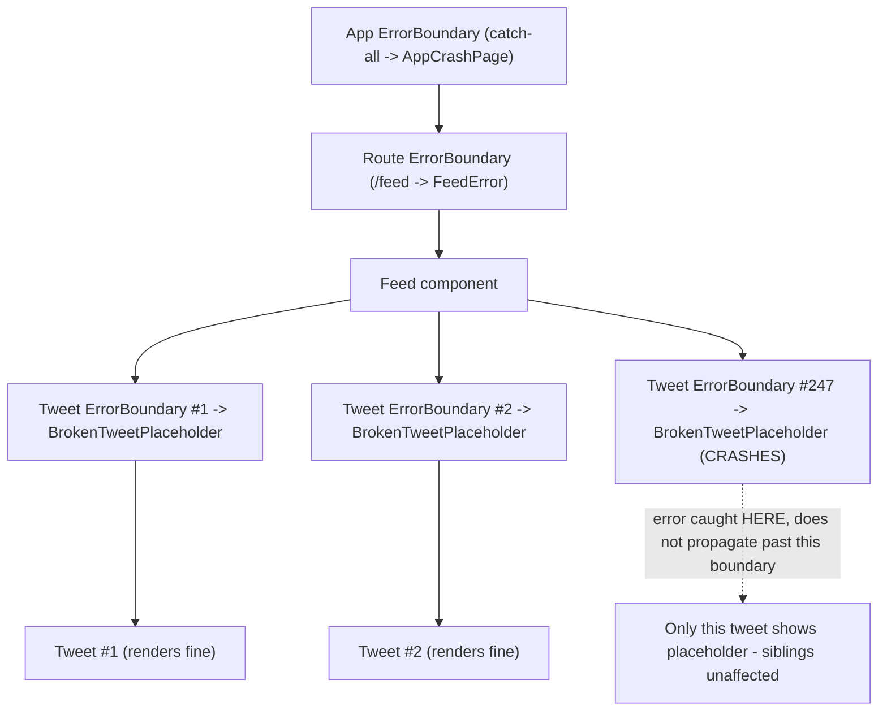
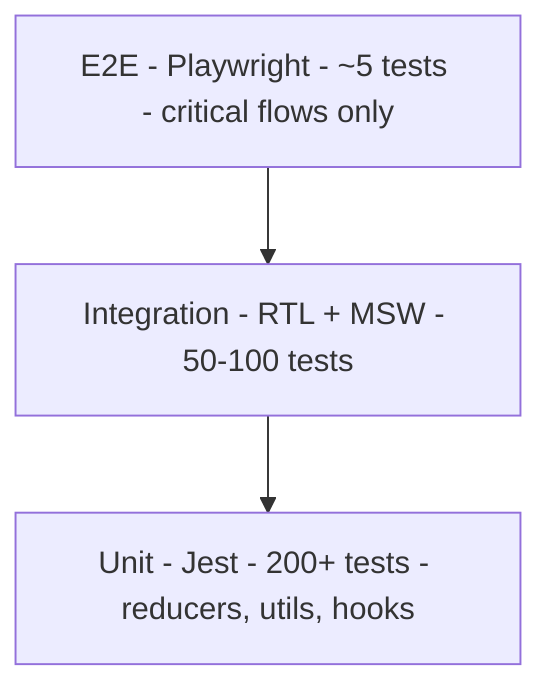
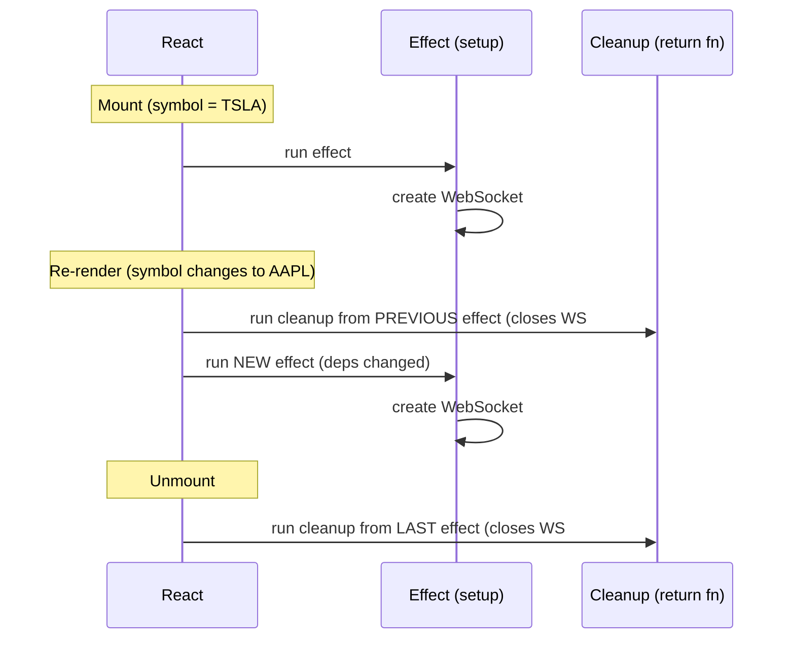

# Mermaid Diagrams (extracted from advanced-interview-questions)

This file collects the original Mermaid source blocks that were replaced with ASCII-art diagrams in their source files, so the Mermaid source is preserved for rendering elsewhere.

## [08-error-boundaries.md] Detailed Explanation

## [10-testing-strategy.md] Detailed Explanation

## [16-useeffect-cleanup-lifecycle.md] Detailed Explanation

## [07-react-design-patterns.md] Detailed Explanation

```mermaid
flowchart TD
    Need["Need flexible, reusable component composition"] --> Q1{"Do you control the structure via children, like <Select> <Select.Option>?"}
    Q1 -->|Yes, consumer controls structure| Compound["Compound Components (Context + sub-components)"]
    Q1 -->|No, structure is fixed by the library| Q2{"Does the library control WHAT/WHERE, giving you only content via function-as-children?"}
    Q2 -->|Yes| RenderProps["Render Props (e.g. react-window itemRenderer)"]
    Q2 -->|No| Q3{"Is this a cross-cutting concern wrapping an ENTIRE component (auth, tracking)?"}
    Q3 -->|Yes, at route/page level| HOC["HOC (withAuth, withPageTracking)"]
    Q3 -->|No, logic needed INSIDE a component| Hook["Prefer a Custom Hook instead"]
```

